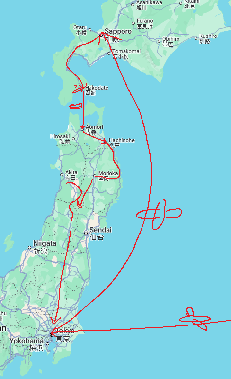
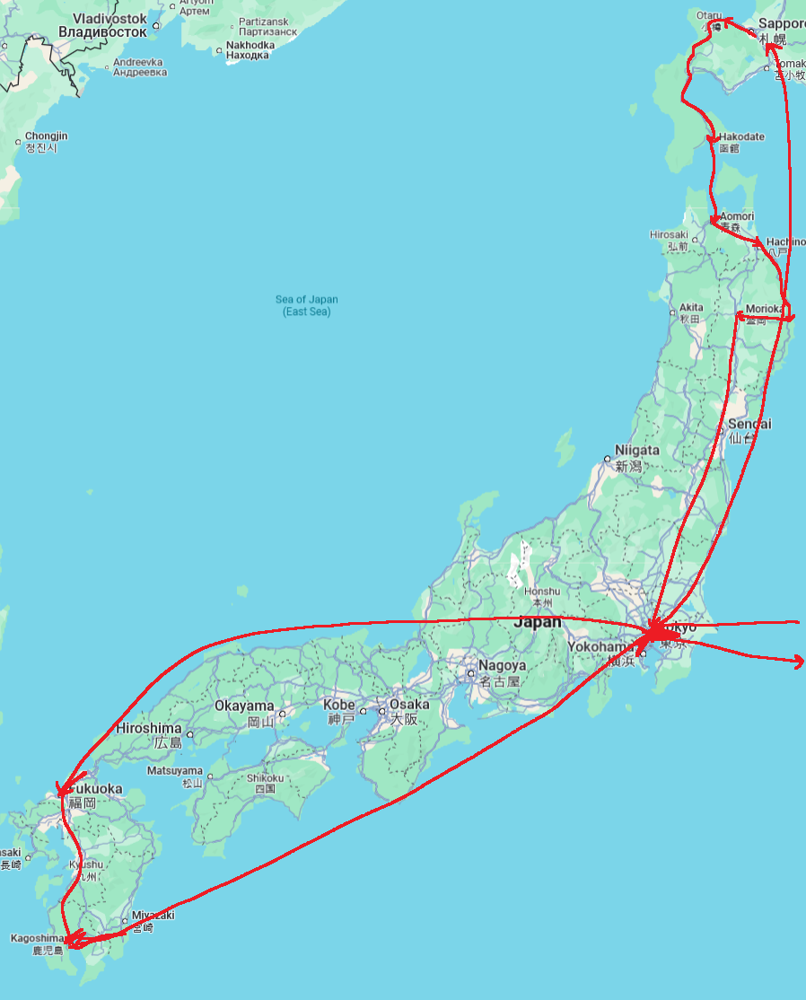

# preface and pre-trip plan
hello, this is a trip i took from approx 2024/10/11 to 2024/10/27. I went to Japan and came back.

I plan this trip with friend. Friend and I didn't have too specific plans even though it kept discuss and tried to plan. The plans kept change, but the final general plans was this:

1. meet in TOKYO
2. after few day in TOKYO, take plane to SAPPORO
3. go SOUTH in HOKKAIDO, making a stop at HAKODATE
4. take a boat from HAKODATE to AOMORI
5. go to HACHINOHE
6. travel along east coast to MIYAKO
	- make a stop at NODA
7. travel inland to MORIOKA
8. go SOUTH and DO WHATEVER and end up back at TOKYO

# flight to Japan

My flight was direct from IAD to HND. It was around noon, thus I ate breakfast in my house and my father dropped me off at the airport (thank you), and I rode the airplane.

::: aside
## this airport security
it was probably first time in united states i been to that they didnt using the um big cylndrical scanning machines that are scary. they just had a rectangular metal detector that you walk through i believe.
:::

The flight was nice, I guess. The food was nice, top-tier airplane food I have had. They gave ice-cream after one of the meals even, wow!.

The whole flight I did not recline my seat because I once heard something that it is rude to recline ur shinkansen seat (which has like 2x size of the airplane seat) without first asking the person behind you. And this was on Japanese Airline and the person behind me looked Japanese so I simply did not recline it, because i did not want to ask, and also since any way sitting in the airplane seats feels terrible in any way so I figured it would be equally worth my time trying to sit straight upright with an erect spine.

::: aside
## aside: anti-lumbar-support
why does it feel like airplane and a lot of other seats have anti-spine-support, i.e. if you fully press ur back against them ur spine will be curved in a really weird unnatural position. idk perhaps my imagination.
:::

In the airplane I did things like try to sleep, and watching movie on the in-flight entertainment thing.

I watched two Japanese movies in a last-minute effort to Japaneselanguagemaxx before entering the country.

The first one I watched was very healing. It was great in that it started with saddest part and then the rest of the movie was simply healing from the sad moment. it was great and I felt healed.

The second one was kinda the opposite like it was kinda nice and cute in the beginning and then got spooky and disturbing at the end, so any healing that I had with the first movie was undone.

I also slept some, I do not remember how much. I used the technique of covering-eyes-with-mouth-mask. I also tried to sleep sitting upright (i.e. with back away from the chair which weirdly bent my spine if I sat into it). I am not sure if these techniques helped me sleep much, but I did do them.

# Arrival in Japan (first night)
I arrived at Haneda airport. I went through immigration and customs and met my Friend who arrived at similar time and was waiting in Airport.

We walked around. Decide first thing to do was get sim card. I read online somewhere there was sim-card vending machine somewhere by the KEIKYU LINE area thing. We walked there, saw the machine, it looked expensive. So walked more to see if there was any other options.

We walked up from 2F to 3F (departures) looking for a seven-eleven bc I wanted to buy sim card there, but we couldnt find it (it was behind us). Instead I saw a BIC CAMERA up a floor or so we went up there. I went in looked at the sim cards. Bought a sim card, and also a cute travel toothbrush+paste+plastic case thing, the same one I bought in my 1st trip to Japan except it was like half the length and also pink. Friend waited outside figuring out buying they own ESIM thing I believe.

::: aside
## how was the checkout like? (progress update)
I had'vst anxiety paying for stuff in Japan. I am not entirely sure why. However I can theorize. Perhaps it is because I am afraid of looking stupid when they ask me stuff and idk what they just said and I awkwardly try to look confused so they know that idk what they just said. Or perhaps it is because I am afraid of even if I understand and can roughly nonverbally respond to their dialogue they think I'm being rude due to my nonverbalness. And etc.

However I think that after many exposure therapy of checking out, the anxiety is slowly going down. Not sure. Or perhaps it went down specifically in this trip because have Friend Support or etc. I am not sure. Still have my good, and bad moments.

However this BIC CAMERA checkout was not too noteworthy. Average. I think I just put the stuff on the counter. they went to go find the sim card (represented by the cardboard card thing I brought to register) in a bunch of bins in the back. and they showed me some information sheet saying some stuff like "it is data only" and i forget what else. and I nodded. and I payed with credit card. and etc.
:::

We both got the SIMs now and together we sat down and tried to find hotel to stay in.

We had tried look for hotel about a day before, however Tokyo hotel prices on the Weekend is quite high price and low availablility, at least compared with other days of week and other locations. Thus we decided that perhaps if we postponed our decision to even later, maybe price would slightly drop, or availibilty improve (last-minute cancellations?). However it was still quite high price and low availibility. Maybe slightly improved? But probably not.

Many times something looked like good and we clicked on "Book" button in Agoda app to book it. But then Agoda say something like "oops, someone already booked it". Very unfortunate. Eventually we decided and successfully booked some place in [Mejiro](目白) and we went to take the KEIKYU LINE to it.

Rode the KEIKYU LINE to shinagawa and got off to transfer to uhh.. idrk. I did not really think of how to transfer trains. i just saw that MEJIRO was like 500-something(?) yen on the KEIKYU fare map in haneda airport, and thus I bought that-value ticket for Friend (who did not have cash or IC card yet), and we went on our way. However get off at shinagawa station, it was confusing. IIRCed the keikyu fare map had a loop resembled the JR YAMANOTE line which we would have to enter to get to MEJIRO. However how do we enter this loop? Was it transfer to another KEIKYU train which run parallel to JR YAMANOTE line? was it literally just transfer JR YAMANOTE? it was quite confusing. i stood there confused a while, and i believe friend was probably also confused, perhaps also confused why i was confused.

There was some points to consider:
- it seemed the keikyu trains only went in two directions (towards and away from haneda airport). thus I was convinced that probably indeed had actually transfer companies (From KEIKYU to JR)
- there were two largely labelled exit options:
	1. EXIT (the station)
	2. TRANSFER (to JR)

So it was tried that friend insert they KEIKYU ticket into the "transfer" gate. It did not work, probably because it was a KEIKYU ticket and idk why it would work. Some attendant said something to friend (idk what) and pointed in the direction of exit. idk what that meant. did we have to exit and repurchase a JR ticket? hmm. That would be possible, however it would waste several hundred yen because

1. the keikyu from HND to shinagawa only cost uhh 500 yen i think. and we had ticket worth 500-some yen. Thus lose that difference because no refund
2. JR ticket from shinagawa to mejiro is 200-some yen (210 i think?). thus we lose that money also unnecessarily because we are supposed to have a ticket already good to get to mejiro.

But we strolled over in the direction and accidentally stumbled across something that made sense, which seemed to be a booth exchanging KEIKYU tickets for JR tickets. oh that made sense!. So, I took friend's ticket and went up to the booth and said "mejiro" and they took ticket and probably said sth i didnt understand, and showed me 210(i think) on some register. so i thought: damn have to pay?? what?? oh well. and reached for wallet, but then guy was like "oh no thats just the ticket value im gonna give you" (i assume), and gave me the JR ticket. woww!! so nice.

And then with that JR ticket friend could go through transfer gate just fine and etc. how nice!. I was using IC card and all of the transfer was done automatically i think, how convenient.

Took YAMANOTE to mejiro. it was quite crowded, perhaps because a weekend night in tokyo.

We checked in to hotel and then exited hotel to look for food to eat.

Look around mejiro station but nothing really appealed.

Decide to walk northwards to IKEBUKURO to a MATSUYA and perhaps eat somewhere else if anywhere else appealed along the way.

Walked through some empty quiet nice peaceful streets was nice. eventually reached IKEBUKURO where we ate matsuya. and then we walked a little around IKEBUKURO, visited [MUJI](無印良品) where bought SOCKS and a PEN and look around a DON QUIJOTE because i wanted to look for rfid-blocking-sheet and/or a wallet and friend want look for a small bag. Dont buy anything, exit walk back, stop by MUJI because friend buy small bag there, walk back hotel peacefully. photographed a vending machine, walked on a bridge, etc. also stopped by some convenience stores buy some travel supplies.

::: aside
## The rfid-blocking thing

I wanted to put my IC (transportaiton) card in the back of my phone so that dont have to carry card separately. just tap back of phone to ride train. however i tried this before didnt work, maybe because phone electronic mess with IC card thing, not really sure. However i looked up and they got a thing you can put between your phone and IC card to prevent that from happen. RFID-blocking sheet? IC card error prevention sheet. something like that. i wanted that. and i spent many times first few days look for it.
:::

back at hotel, washing, brush teeth, sleep (probably). i believe also i really had to use the bathroom while friend was using bathroom to wash but luckily nothing bad happened.

# October 13

As somewhat expected, I awoke around 4am or so. I seem to always woke up around that time the first day(s) when arrive into this time zone. Or maybe I first awoke midnight. I am not sure. I awoke many times during the sleep I believe. Some time around I think 5am I felt the room slightly wobble or something and I wondered if that was an earthquake. I asked friend who I believe turned on they phone screen shortly after the earthquake occured and apparently it was.

I did not fall asleep after that. However friend did, I think. I went out to take morning walk around Mejiro which was just ppls houses essentially.

Returned to hotel. With friend, exited hotel and walked south to eat breakfast at a Denny's. The Denny's order experience was:

1. walk into the Denny's
2. someone might have told us to sit wherever we want (maybe not)
3. sit wherever we want
4. touch the tablet in order to order food
5. Wait for food to be served by a person

while we was waiting for the food, we discussed things, but also whether the water was free or not.

Based on my experiences now, I believe it was free. however this was before experiences, and it was unclear. we discussed how to ask someone whether water was free.

Eventually the person came with our food. I think they said something that we both didnt understand. Perhaps it was like "is that everything (that you ordered)?", idk. However i think when we acted confused they said something in english. i think which prompted friend to ask if water was free (in english). and then i think they replied something abt it could/should have come with "drink bar" or sth as part of the deal. but actually friend didnt order the "drink bar" as part of they meal. and then person said that they can go modify the order or so. thanks that person!.

but actually I think friend didnt end up drinking any water. We ate the food and went to go pay. This involves bringing the receipt thing they put in the little plastic tube at ur table up to the front counter.

They said sth abt the modification of drink bar and then friend said oh actually i just didnt drink anything. and then i think person said something along lines of i think: oh oops i already modified it let me umm modify it again (or sth, im not really sure). so then they did some stuff (thank you) and then i payed with credit card and we left. And so ended my first family-restaurant experience.

::: aside
## the family-restaurant experience
I had never eaten at family restaurant in Japan until now because scared to go in alone. However after trying it now and several times in the future, it was great and nice. There is people eating alone, and also many chain family restaurants have tablet order and/or self-pay so it is actually less socially anxiety than regular restaurant. It is a great variety of restaurant.
:::

Walked around Mejiro area. around university. University seemed closed to public, so did not enter.

Walked back to hotel, retreive belongings, check out of hotel. Briefly stopped by convenience store across street to buy um.. i just remember Masks but might have been other stuff also.

We then went to Shibuya in order to purchase glasses. I forgot to mention this but part of pre-trip planning was plan to purchase glasses in japan.

::: aside
## person that asked us for directions
I believe it was here that we was waiting at MEJIRO for train to SHIBUYA and someone came up to us and showed us translator screen from i think chinese to japanese asking sth like um tokyo station uhh bus? idrk, idk japanese.

i dont really know what we said, maybe we just looked confused. And then they said sth (in english?) like i wanna go to tokyo station, which train do i take? (between these two tracks). We were standing on YAMANOTE-LINE platform with one track going clockwise and the other going counter-clockwise i think. And so i tried to say sth like yamanote is a loop so it doesnt really matter which direction you take but if you look at this map, going through UENO is probably slightly faster (not sure if true). so they went and took that train. And we missed ours going the other way but luckily it come every few mins so we didnt wait for much for next one
:::

At the glasses place, decide the frames. Then friend begin process of purchase. I did not yet do it because i was not actually sure if wanted to buy glasses. and wished to simply observe the process before going through.

The process was as follows:

1. complete a process on an electronic kiosk
2. some person will do something maybe and send you to a different people
3. different people will do stuff like asking ur prescription and verifying prescription based on ur current glasses. And getting the frames u want. and asking what lens options u want. then they send u to someone else
4. The someone else will then adjust frames to ur head i think. and then collect ur payment and stuff

When all was done, it was um around 1pm i believe. Original plan was to eat Vietnamese food around the area then go to Yoyogi Park to enjoy an Event. however it was already late and Event had higher priority thus Went To The Park without eating.

The event was pretty Chill it was People dancing to Rock n Roll In The park.

After observing the people in the park, go to eat. It was decided to eat a convenience store food orso in the area so that it can return to the park in quicker time in order to continue observing. However, saw a MOS BURGER which i had always wanted to try, thus went to MOS BURGER. The self-order kiosk was only in japanese i think. however, use it order. get a pager sit down wait for food at a table.

They had a very nice hand-washing sink with paper towels. that was great. Got food and ate it. it was tasty food, top-tier burger.

Returned to the park fulfilled. Observe people longer until seem like they say goodbyes to each other and disperse.

Returning to Shibuya in order to pick up one of Friend's glasses which was ready same-day. Along the way we ran into parade of politics people i think. We decided to walk behind the parade a bit. The parade had a band on a truck playing groovy music, which was fun.

Got to glasses place, friend got they glasses, and I went through process order a pair of my own.

Then, went to eat vietnamese food. it was yummy. Vietnamese restaurant eating process:

1. enter
2. somehow communicated that we was two ppl
3. they brought over some water thx
4. was a QR-code menu ordering system thing. order on phone.
5. They bring food
	- i struggled to say "thank you" (in japanese) as usual. my failure to say "thank you" felt even more disrespectful in the context of this restaurant, idk why. However luckily friend said it normally it seems.
6. Eat food
7. In order to pay, went up to front counter. I was going to pay with card i had my card ready. But then there was sign saying CASH ONLY. Thus last minute pulled out cash oops.
8. Leave. i think friend said thank you again. thank you friend for saying thank you!

Then, took a train to Narita (city) which was where we was staying for the night. We stay there because flight next day morning. Originally i think planned to eat dinner in Narita. however end up just arriving there and wash, go to sleep I believe (because we had eaten dinner in shibuya already).

::: aside
## find rfid-error-sheet progress

some time when returning to shibuya i think stopped by a bic camera and also a daiso to look for that rfid-error-sheet something. nobody had it. however i looked it up online and i saw yodobashi camera had one. so it was determined to perhaps get it at e.g. shinjuku yodobashi orso. however later in evening it was decided that was not along the way. simply skip shinjuku go to narita. anyways can get it at yodobashi elsewhere in country.
:::

# October 14 (flight to SAPPORO)

We woke up in the morning and went to NARITA AIRPORT in order to take the flight to SAPPORO that we had booked a week or so ahead of time nice.

In the airport friend had some issue with they bank or credit card orso and resolved that while walking to the terminal and while i used bathroom, nice.

Check-in process was completed with a self-kiosk digital. There was no passport needed i believe suprisingly (but also not suprisingly because it was a domestic flight so idrk why they would need it).

We ate breakfast at a MATSUYA before security, then went through security. I did not know if large liquids can go through security for domestic flights bc im pretty sure in usa its not allowed. So i just emptied some liquid bottle i had in bathroom and recycled bottle i believe. And went through security.

The flight was one of first flights i think ive been on where entire plane is i believe same type of seating. like there is no big seats at the front for high class and smaller seats in back for low class. Thus we was sitted near the front of the plane which was cool, i dont think ive ever sat near the front of plane.

When getting to our seats i accidentally passed the row where we sitting and thus i just stood awkwardly behind the seats because other ppl was passing me getting to their seats and would have to somehow stop the flow of ppl in order to go in opposite direction to reach my seat.

However luckily an cabin attendant at front see so, walked over blocking incoming traffic and ask me is that ur seat (in japanese) which i somehow affirmed (idk how), and also the person with the row seat perceived and got up so can get to my middle seat. Thus the problem was solved.

::: aside
## I was middle seat
There was three seats (on each side of plane i think). Friend was Leftmost (window seat). I was middle seat. Stranger was rightmost (Aisle seat).
:::

The flight (NRT to CTS) was short with no snack or drink or nothing. Out the left window could see many nice scenery of EASTNORTH japan and etc. and also Mount Fuji at the beginning which was cool. It was sunny and clear. Also i remember that the seatbelt orientation felt opposite of what i was was used to. I am not sure if it actually was or what the conventions of seatbelt orientation is.

Soon arrived at CTS and take train to SAPPORO. Get off at SAPPORO STATION it was feel cold. Quite cold. I also recall that the imagery getting off train was cold and depressing and what I thought was "eastern european" (which I probably just envisioned as cold and depressing even though i have never been there).

Friend was gonna put stuff in coin locker but all of the lockers was full. Thus went to hotel and asked to hold bag until checkin time.

Then went to the YODOBASHI CAMERA to look for the rfid thingy i wanted. Site said had some stock of one product (though i think it said not on display). So friend asked about it for me to worker bc i did not want to, and worker guided to section with the relevant products. I bought the thingy, and friend a cable, and we left.

And then went to a uniqlo to buy some clothing. It was first time using fitting room in japan. However in this case it was just walked in, someone say use that one, and then u use it, and then walk out. interesting.

Then I believe it was time to eat. Friend want to eat "SOUP CURRY", so went to a place. Here was the process.

1. There was a queue for the restaurant, indicated by people sitting on chairs outside
2. Join queue by sitting on chairs, looking at menu.
3. Worker came out some time and perceived us and i think asked how many people we were and also gave us an english menu.
4. Some time later worker came out again and took our order. The order was slightly complicated in that there was multiple things you had to choose. however it went smoothly, they took order, and we continued waiting in queue.
5. Eventually called us into restaurant and seated us.
6. And then brought food over.
7. ate
8. bring the receipt to the front. they had a self-checkout thing where you just scan the receipt at the machine. and then you can pay into the machine. how convenient!

The food was quite very yummy. also i ordered rice [large portion](大盛) and it was very large, one of largest [large-portion](大盛)s ive ever had.

When done, go to hotel and check in i think. Then i do not really remember what we did. All I remember is three general points:

1. Friend's passport ID page was accidentally folded (sometime around this checkin process i think?) which caused them to be very stressed and want to e.g. contact some kind of embassy or consulate or idk, but end up they are closed because it was national holiday.
2. We briefly walked around a portion of HOKKAIDO UNIVERSITY
3. I took a nap in hotel room because i was very tired. And then when I awoke i decided i was still tired and wanted to simply go to sleep.

Overall quite a depressing day, especially considering it was friends birthday.

# October 15 (SAPPORO)

I woke up this day some time 4 or 5 again. Friend was still sleeping so I went out for a morning walk.

It was quite very cold, especially because i was wearing shorts

::: aside
## did people gossip about me
In SAPPORO it was quite chilly and everyone was wearing long clothes, and especially black outerwear. In contrast, I was wearing shorts (i was planning on buying pants later), a blue shirt, and some goofy-looking sandals (with socks).

I think it was yesterday that we was walking along on the street and we was stopped at a pedestrian crossing and i heard some ppl behind me talking, and i think i picked up some key phrases e.g. "sandals" that indicated that they were gossiping about me. However i dont actually know if they was bc i dont know japanese. Thus i had anxiety.

if i could have understood what they was saying fully i think i would have been less anxiety, but it was the scary intermediate zone of "think potentially gossip but maybe not but probably so"

either way, it remained in my memory
:::

I walked around a bit in the streets. it was pretty quiet

Outside of some parking lot there was a "halloween macaron" vending machine vending halloween macarons. It looked funny so I got the mint-chocolate one for friend as late birthday present. I think we mentioned potentially going to SAPPORO pastry shop or so for bday but we never did, so I guess this was next best thing.

I walked more, and eventually friend woke up and indicated was ready to do stuff. So I took a train one stop back to SAPPORO STATION and met them, and we walked over to a sandwich shop SANDRIA which i think is famous friend said. (side note: I think they had a sandwich vending machine at sapporo station, which had a queue of people waiting to use it) On our way saw various things, e.g. crows flocking around a garbage truck collecting garbage.

We stood outside for a while staring at the menu posted in both Japanese and English and decided order. I gave friend cash (i think it was cash-only) and we walked in and friend ordered at the counter, which was told them "(Menu name) One" for each menu name wanted i believe.

They took out the sandwiches requested and took payment and gave sands to us in a bag i think and we left, after first looking at the hot-coffee(?) vending machine which looked to be out-of-service.

In order to get drinks, we went to the SEICOMART across the street, and they had a hotbox (hot refrigerator?) of warm drinks, thus i got tea and i think friend got coffee and we payed for those and left.

::: aside
## what happened at the seicomart checkout?
It feels like every non-self checkout ive performed in japan (and many ive done in not japan) has been imprinted in my memory. However tbh i do not particularly remember this seicomart checkout. Perhaps probably because it was not performed by myself, and mostly done by friend actually

I think the worker might have asked something like do you have a point card to which i body-language-Anti-Affirmed or so. But im not sure if that actually happened or what happened. Also that might have actually been the seicomart on day 18.

I also think they gave us a bag, and idk if there was any related dialogue for that. Or actually we didnt get a bag. i forget. maybe we didnt.

all i really remember is friend saying "suica" to indicate that they wished to pay with suica (on their phone), i think.
:::

We walked with our food to a PARK to eat it. On our way there was a Kimchi Vending Machine which was cool and funny.

We arrived in the PARK and ate our food on a bench. The food was very good. I especially liked the potato-salad bacon sandwich because i like potato salad. The tea was still warm which was nice.

I played on the slides a bit. I slid down a slide which actually had water on it and my pants became very wet. I also hit my head climbing into one of the slides quite hard, like i could feel my teeth clacking together bc of it. And i swung on a swing.

Eventually left, took train back and walk to hotel.

Now it was DO FIRST LAUNDRY. There was coin laundry in hotel it sayed. So it go there with our laundry. I only had one pair of lower-body-clothes (shorts) thus i wore that um robe they usually provide in hotels, and the room slippers. down to the coin laundry. However it was soon discovered that i dont have enough 100-yen coins to actually perform laundry for both people. Thus it do the following plan: to go downstairs to lobby and ask shop or front counter to exchange a 1000-yen bill to 100-coin. Here is what happened:

1. elevator down to front
2. i walked up to front and said sth like "(kore) [HYAKUEN COIN DE](百円コインで)..", and they successfully understood (on the first try!), and gave me 100 yen coins thank you wow!
3. go back up and did laundry.

i noticed later that actually in a sign at room it said to pls dont wear room slippers or gown outside of room. oops!.

The laundry driers was very underpowered. But also i think it recommended like 60 mins drying for the stuff we was drying but i only did 30 mins. Friends stuff (more volume) still unsatisfactory dry, so dry for longer. However we both decided to air-dry some stuff. Unfortunately nothing really air-dried in like 30 mins to an hour. We tried use the room's hair dryer to dry some stuff and i guess it worked a little, but not a lot.

Eventually when laundry all sorted out, check out hotel. Walked to train station to put a things in a coin locker. Then walked to HOKKAIDO UNIVERSITY campus to look around.

First, stopped in university goods store, where friend purchased some souvenier clothing. Then, walked around the campus. Funnily, there seemed to be a lot of fellow tourists. Took some photos and stuff.

Eventually came across a cafeteria. The cafeteria on a sign say that cannot serve non-school people within some hours, and we was within those hours. Continued on.

Found some engineering building i think, and inside they had another cafeteria. Wondered if could eat there. but left.

But when leaving saw someone speaking english looked like may be international student, friend asked me if should ask that person whether possible to eat at that engineering building cafeteria. I said yes. Friend asked person. Person said that maybe or maybe not. But northern-er cafteria probably everyone can eat, do not check student id, etc. Thanks for the information! Thus, went north.

Arrived northern cafeteria. It was quite intimdating bc first time in such an environment. They had menu posted. And some arrows on the floor directing ppl into lines based on what kind of food u wanted. Idked what eat. Friend maybe decided something but dont remember. Eventually go in with our trays. I just end up go to line that had a line so that could observe the precedent of how u would get food. Friend was in front of me in line. Friend order something, say can order for me also i think. But end up i just order. Friend said sth like "MENCHIKATSU LARGE" i think, and i said sth similar, and it worked. That was not too bad. And then saw that side-dishes was you just take yourself. So took some. And also i believe friend went and got a hamburg from a different line.

And payment was you stood in a line and someone would look at you trays and calculate ur total and u give them payment and be on your way.

Idk how it was indicated that we pay together but somehow friend completed payment with me give them cash, and the payment lady gave us each a box of milk also which was nice.

Found some seats and sat down. Got up and bought drink from vending machine. I saw there was also self-water, got some water. Though i took two cups before realizing that i think there was a sign saying TAKE ONLY ONE CUP BRO. I also got some french dressing for my salad thing.

The food was pretty good, like def not awe-inspiring but def cost-performance good, and fulfilling, along with an environment that will slowly again never experience (existing among young people).

Was lot of food, I barely managed to finish all my stuff. Eventually finish eat, put trays in tray collection, leave.

Walked around campus a bit more. Walked into this barn-museum area where u had to leave ur name and country of residence and stuff on a sign-in paper (but it was free). Walked around that. there were cow statues and stuff. and barn-related exhibits.

Eventually leave. And friend say along the lines of: OK i wanted to go to hokkaido univ. Now we went it. So now i do whatever, you decide.

Before it was planned potentially spend perhaps two days? in Sapporo. However it was decided leave now. Thus return to coin locker, retreive things, take a train northwest.

The fastest way to leave SAPPORO and go south is actually to go SOUTHEAST i believe. However i wanted to take a more scenic route which is GO NORTHWEST before eventually GOING SOUTH.

Take train northwest with terminal in OTARU. It was not sure whether to actually stop at OTARU or simply transfer to next train and go further.

However looking at hotel availability or so or idk, i believe was decided to simply sleep in OTARU.

So riding to OTARU terminal. However friend read a weather forecast and saw rain and thus wanted to buy an umbrella at a [MUJI](無印良品) shortly outside of [小樽築港駅](a station), thus first stop there and go to the MUJI.

Arrive at the MUJI (it was in a shopping mall connected to train station). Look around for umbrellas, it could not find any it seemed. hmm. strange. Circled around shop like twice or so cannot find. So on behalf of friend I looked up the word Umbrella in Japanese which was KASA and walked up to an employee and looked like i was trying to find something and said "[KASA WA](傘は)".. to which they guided us to front of store where the kasas were. I might have tried to say something like thank you but it was more like unintelligible mumble. luckily friend is better at saying thank you so maybe they said thank you.

::: aside
## saying thank you
i have managed to say various things in JAPANESE language. However [Thank You](ありがとうございます) still remained and remains a challenge for me. idk why. perhaps i am still trying to process its phonetics. or maybe situations never force me to actually say it so i can simply get by without saying it. not sure. each time i always thought, "wow now i will finally say it". but then i fail to say it, and feel slightly rude.
:::

So got the umbrella (muji has self-checkout) and took train up to OTARU STATION. i booked the hotel we staying at while waiting at the train platform i think. Also while waiting train platform friend bought coffee from vending machine and discovered it was hot, and thus we had come across our first WARM VENDING MACHINE i.e. vending machines that have been configured to dispensed warmed instead of chilled drinks. wow cool!.

Get off OTARU STATION and walk over to hotel.

Check in to the hotel. This hotel room was neat because it was Japanese-Style room i.e. tatami flooring and you sleep on futon (not couch).

Then exit hotel walk around, but go back to hotel bc friend wanted jacket, the reexit hotel, then walk around.

There was a "canal" popular tourist spot i think. Walk along canal. was cool. Take some pictures and etc.

Eventually was time for dinner, ask friend what is for dinner. After indecision, decide to eat OTARU some kind of like local representative food? which is-- fried? baked? chicken thing.

So walked to that place and walked in. There was some kind of miscommunication trouble where i think person was asking if we was here for take-away food because they got that. Somehow eventually got seated at a table. The ordering process according to a card on the table was to order at counter and they would bring food over. So we did that; friend did the talking.

Received the food. i had a Chicken Meal and beer. It was OK in the beginning but the chicken gradually tasted salty af like almost inedible-level salty idk what was up with that. Probably worst meal had this trip i think.

Finished food and left. Walk back to hotel, stopped by a convenience along the way because friend buy something. Also got him to include nonalcohol beer in his purchase because i wanted it. It was some kind of local beer it said i believe. It tasted very strange, like watered-down doppelbock. Not very great taste.

In the hotel room wash and go to sleep and stuff. I also enjoyed to sit watching some random NHK E kids program sipping on my nonalcoholic beer.

# October 16

Today we woke up. For breakfast we exited hotel and walked over to a BIKKURI DONKEY which i did not actually know what it was but turns out it is a HAMBURG (family) RESTAURANT. The process was as follows:

1. Enter
2. The person might see and probably asked 二名様ですか orso etc.
3. Become seated
4. I think they came over and said sth about now the ordering being on tablets. Thats what i think they said but idk bc neither of our persons know japanese very much. Ive never been to a bikkuri donkey before so idk if the ordering used to be indeed not on tablets.
5. Place order on tablet
6. They bring stuff over
7. Eat
8. When done eating, bring receipt(s) they gave you (in ur plastic table tube) to the front. They had a self-checkout i.e. you just scan the receipt and do payment on machine. How easy!. done.

::: aside
## when they bring food over
When server brings over food it always feel awkward for me. I have never fully learned what the actual social script is supposed to be like. The server comes over and says sth like "Who ordered the <?>" and you indicate who ordered the <?> and they give that person the food. This continues. Im guessing you should probably say thank you. But if you dont what do you do? just blankly stare into space trying to act as a neutral entity of the restaurant? um. idk. I forget what i was writing about.

And then they will often ask you something like "Is that everything you ordered?" In japanese. I think they might ask this in different ways. I forget exactly what they ask in japanese. Also idek if thats what they ask all the time. but i think it is.
:::

I had a small um hamburg set and also a TAMAGOKAKEGOHAN. pretty yummy stuff.

Leave, go back to hotel. Friend do laundry because He got new clothes to wash and also gonna wash old clothes that i request can i use because i am pretty chilly could use more clothes. So he do that. He told me he meet some funny character while drying they clothes and end up drying they clothes together. which i still dont really know was a real person or not. And also the hotel drier (i think it was a combined washer+drier) did not dry very well, again. And clothing was slightly wet still.

Check out of hotel, then walk around some touristy area because friend want to browse some sweets shops. I also got one of those fortune things that you put coin in box for payment and take a roll of paper for ur fortune. Idrk what the actual fortune said but i could understand stuff like my Lucky Color and Lucky Item of the day which was cool ig.

Also, went into some cafe, friend ate an apple pie and coffee. Eventually done with the area, walked down to MINAMI-OTARU station. Took some pictures n stuff on the way. Friend explained what camera APERTURE does to photos.

Took train one stop up to OTARU. Then get ready to transfer to another train to go further northwest. However some signs indicated that IC card would no longer work in that area. Thus it exited gates to buy tickets.

Friend was doing stuff with ATM but train leave soon, so i bought two peoples tickets valued for YOICHI. quickly went up stairs i believe. Train look like its about to leave i think. walk up to it. Train person said sth like "going to ? ?" and affirmed. And then they said "wait a minute" Im not sure to us or to the train driver(?) and idked who they said they words so i just stood there with friend until they pressed the door button for us and we went inside train.

I think this was the first "ONE MAN" train have ever taken. Actually it might have not technically been "ONE MAN" since i think there was conductor(?) also?. And actually i think train from SAPORO to OTARU might have been uh "one-man" technically. I do not know. However I think it was the first train i ever took that potentially stopped at unmanned stations. And I was unfamiliar with these kinds of trains. And as the train was making its stops I was slightly worried and confused about things. I believe I was worried that when train was making stops, people needed to go to front and present something to driver before getting off. However in retrospect this makes sense i believe. because they was probably getting off at unmanned stations(?) and thus needed to present they ticket *on* the train because nobody would check it *off* the train. thats my thoughts.

But eventually reached YOICHI and all the train doors opened and dont need to show train-aboard person anything. Just get off and go into station where a person was waiting to look, take ur ticket.

YOICHI was actually not the terminal station of the train we took. however i wanted to stop by because it had Sea-access. So we walked to the sea and i breifly saw the sea. The sea was nice. i walked in the water a bit. There was also a singular someone surfing in the water i believe.

Walked around back to the station. At this point it was 1:30pm i.e. time to eat lunch. But um i think everything seemed closed (many place close from around 2-5) or idrk what, decide to just eat at the next terminal station we would have to transfer at.

Took the train to the next terminal station, KUCCHAN. Got out the station wonder where to eat. End up eating probably most-close-to-station place that was open, which was some random "family restaurant".

This family restaurant was the first time i ever ordered vocally in japanese i think. Woww!. We enter, and probably went through the usually IS YOU TWO PPL and stuff and SIT HERE/SIT WHEREVER YOU WANT process. i think they also brought out the menu on a clipboard i think. And then i believe when it was bringing over water i made it look like i intended to order and pointed to something and said [KORE FUTATU DE (ONEGAISIMASU)](これ二つでお願いします). i actually dont know if [DE](で) is the correct particle in this situation but no matter since they probably could barely hear me anyway. And they said FUTATU? and i said yeah and they said OK and went away (or something like that. i actually dont think i remember much).

And then they served the food, which was like a whole fancy meal, i.e. they brought out a salad first and then we ate the salad and they brought out some soup in a cups and the main dish. It was quite yummy. Friend was especially impressed.

When it came time to payment i paymented which was stood up from chair and look ready to go (my chair was right next to payment counter). The person asked if paying together. i actually dont remember what the japanese was said except the phrase [ISSYO](一緒) and maybe [KAIKEI](会計) or sth but i used my interpretation skills to understood. And i replied something like [ISSYO DE](一緒で) with like sign language bringing the two index fingers together. And i paid the money. In my payment i included a 2000-YEN bill which seemed to induce absolutely zero reaction in the person. And friend showed them a positive message on google translate orso saying food was very delicious and hope their business does well. and we left.

::: aside
## 2000-yen bills
i have never seen a 2000-yen bill and didnt know they even existed except for one time i was watching random japanese tv and they had a segment on them and said u can find them in okinawa and also in foreign currency exchange. "That is funny" i thought. Because i got foreign currency exchange in home. So I got some 2000-yen bills in home-country currency exchange by asking if they got any and i got them. And i thought it would be fun to pay with them in smaller businesses bc i assumed they were unusual bills. However in all the times i payed with them literally i dont think anyone was the least bit unusualed or surprised even though i kept them in crisp condition in an envelope in my bag with cardboard to prevent them from being bent.
:::

After the meal we walked around town. KUCCHAN has a big mountain or hill (now that i look it up , it is a volcano) that u can see from it. Very cool.

Friend went coffee, we go to a cafe. Friend got coffee to-go, we walk back to station. A peaceful atmosphere.

We took the train to OSYAMAMBE. At one point sitting on the train i was slightly panicking checking my pockets and stuff for my train ticket, I could not find it. I remember i put it into right pocket, which was also pocket i store my phone. Did it fall out of my pocket earlier when i went outside take picture of train before departed with my phone?? oh no!.

However an old dude sitting in seat across from us noticed, and nonverbally pointed to the floor beneath seat and i saw that it had dropped out of pocket onto floor. phew!. I nonverbally thanked the guy, I think. if that is possible.

We arrived at OSHAMAMBE and according to the schedule i am pretty sure there was supposed to be a train we could have taken right away. But it did not seem to come. And the arrivals board didnt say anything. And actually, I am not sure if we could have taken the train, because the train person took our tickets before we got off the train i think. I guess because the station was closed at that time?. Or uh idrk. It was quite confusing and stressful. However the train seemed to simply not exist, so decide to take the next train which did appear on arrivals board in 30 minutes.

Exited the train station (there was no gates or anything. no people on-duty at that time). Decide to walk over to a nearby grocery store to see if they had any prepared foods could consume. It seemed they did not. Also walked into a Tsuruha Drug also looking for food. And also i looked at the wet-wipes section. And we did not get anything, walk back to station.

At the station used the ticket kiosk thing to purchase tickets for the next train thingy which was a special express thing. And with our tickets we then waited on the platform.

However it was very delayed. i think one thing mentioned that it was deer to deer collision ): .

Stood on the platform, it was cold. take some pictures. Bought a things from the warm section of the vending machine. I got a corn soup.

Eventually the train came. Enjoyed corn soup on the train along with a cheese biscuit that friend had.

Eventually arrive at our destination: HAKODATE station. When exiting station, friend discovered they had not they ticket. They wonder if they threw it away on accident when throwing away some stuff when getting off the train. So go back to the trash can. Some guy come out and hand over the ticket which had indeed been thrown away. Wow thanks that guy.

Exit hotel and look at a convenience store in station for food. They did not have self register and neither a too wide selection of food so went to Lawson short distance away, nearer the hotel we stay at. They also had no self register but oh well. Bought some food including some popcorn chicken from the hot-case because i saw person in front of us take us from the case and realised it was a self-take hotcase. I gave everything to friend to check out so i would not have to check out, hehe. Idk why we did not get a bag but we did not get a bag. I dont remember if it was bc they asked and we said no thx or we didnt understand them or what. But we didnt have a bag.

Check into hotel. The hotel room was kinda cool in that it had like a japanese-style raised section of the room but also standard western-style part with western-style beds. Interesting. room quite large. due to addition of that japanese-style section. Also out the window you could see the HAKODATE STATION very clearly, very cool.

I warmed up my boxed meal in the microwave located in the vending/laundry/microwave room right outside of our room. And ate it. I also had my popcorn chicken and juice box. It was very yummy overall.

Wash and sleep

# October 17 (hakodate)

I woke up some time before friend so i went out on a morning walk. I walked around some harbor area. Saw water, and some interesting-looking touristy(?) street or so.

Friend eventually woke up text, agree to meet some time around 10pm to eat at LUCKY PIERROT restaurant. For now could eat something small for breakfast. I was quite hungry.

I passed by some some place looked interesting, i think it was bento-place. However i walked inside for 30 seconds and it looked intimidating and no english text, so i walked out.

I walked to a convenience store and bought a tuna-salad bread and a um jelly-like vitamin drink in pouch for breakfast. When waiting behind the person in front of me for checkout i noted that this convenience store you would select your payment method via the customer-facing kiosk and do the payment through that. The person also asked me [SONOMAMADEIINDESKA](そのままでいいんですか) ig to confirm if i didnt need bag and maybe to not microwave bread or sth (do you microwave tuna-salad?), To which i used all my japanese skills to maybe say [Yeah](はい). or maybe i just nonverbally affirmed. And then they pulled over this tray of what seemed like drink samples and then explained to me this very long dialogue i tbh had no clue what they were saying but i assumed it was about feel free to take a sample and if you want um over there something something what?? idk. Anyway i got a free drink sample (i think it was free?) and left the store i had no clue what happened.

I ate my free sample and tuna salad and vitamin gummy water on a bench. A cat passed by me and meowed.

Then i took a streetcar to get back to hotel area!. Streetcar very cool. first time i have been on one, maybe in any country. It was essentially like Bus on Tracks. In the streetcar there was lots of seemed like tourists, perhaps from a cruise ship i saw docked in the harbor. not too sure.

Streetcar was cool but became crowded and i had to squeeze myself to front when my stop came, and i think driver was closing doors when i showed up at front and someone asked like oh ur getting off?orso. and maybe i affirmed somehow i dont really remember. and beeped my IC card and got off.

And then i had to take another bus. Or at least thats what google maps told me i just followed google maps. maybe it would have been same time to just walk not sure.

Eventually met up with friend and walked to a LUCKY PIERROT restaurant where we spent a while outside looking and deciding menu. And enter the LUCKY PIERROT restaurant. The restaurant had quite a lack of any english. Friend was the one ordering. There was a bit of confusion i think esp bc friend order nonalcohol beer orso and person was not understanding and/or the nonalcohol beer on the japanese menu was not actually called "nonalcohol" beer but a specific one called "all free". And after finish order and stuff, worker presented us with some slip of paper in chinese but neither of our persons know chinese so i said sth like "umm (english)[英語で]" to which they just gave us the japanese version (i dont think they had an english version) and said sth like "table number". i think we had to write our table number there we wanted on there. and i assume our order number? i dont really remember. but we did that and put in the collection dish.

The food arrived and the person did the same "is that all you ordered?" line and then collected the number-sign thing we brought to our table.

The food was a lot of food. It was burger and omurice for each person but the portion was very large. I barely finished my stuff (which included some fries). The burger was their signature burger i believe which is named "[Chinese Chicken Burger](チャイニーズチキンバーガー)". like its literally named like "Chinese Chicken Burger" transliterated into japanese. And if you have ever eaten american-chinese food Breaded-Chicken-With-Sauce dish, it tasted like that. Chinese Chicken put into burger bun. It was quite interesting.

After the meal, decide to make a trip to Hakodate MEGA Don Quijote because before the trip friend and i looked at it on google maps pictures and one of the interior views looked very impressional. So we went there, by um streetcar, and bus.

Looked at some stuff inside. I remember i bought a barely tea and i think a vitamin-c drink from a vending machine in it. Look at the view we wanted to see. Looked through a DAISO. i think i was feeling quite tired, still adjusting to jetlag at that point.

Eventually left and walked to a large bus stop. Here, friend and i took separate buses. Friend and i booked separate hotels because perhaps more convenient given our waking-up schedule gap, and also we plan to meet at night and have lamb barbequeue for dinner and i would drink alcohol and friend said i snored loudly after i drank alcohol.

So i took bus to somewhere labelled on google maps as HOKUTO where i had booked my hotel.

However after i got off at the area and walked around i realized that my hotel was not in the area at all. I walked up towards a train station and saw a train passing by. Checking the schedule I realised that was the last train that would come in like 2 hours.

So i walked back down to a bus stop to wait for a bus back to hakodate city area. The streets was quite quiet, only interrupted by some political car(s) driving around with loudspeaker asking im guessing for ppl to vote for them or idk.

My bus arrive, i take the bus. I got off the bus, and i walking. Friend determines what lamb barbeque place to visit, so I start walking to the bus stop to get there. Arrive at the bus stop but bus still many tens of minutes to wait before bus arrives. So, I walk to next bus stops.

Walk past some schools, i think high, middle, elementary school, and school for blind which had a bus stop. I stayed at that bus stop for a bit until i decided to continue walking because google map say i will arrive at destination around same time if i just walk instead of waiting for bus.

Continue walking, arrive at destination. It did not open until 5pm so walked to a park, did not enter the park, and walked back to restaurant.

Waited in the queue that had now formed to enter the restaurant until it opened, eventually was sat at a counter booth. We ordered one plate of meat to start even though later i think i saw something on the menu saying to pls order at least two plates of meat to start. I went to bathroom after we ordered , when came back person had done some grill thingy. idk why but they started the grilling process for like two pieces of meat and then never again touched the grill. Also, there were floss picks and ear swabs in the bathroom.

Had fun trying the different stuffs on the menu. various parts of lamb, and some lamb sausage ate. "hokkaido ramen salad" ate, kimchi ate. I had a beer which tasted like beer, a "haskap sour" which tasted like not much, esp bc i think i didnt mix it before drinking it. And also had a "lemon sour" which was like 80% ice cube. I believe I also challenged my ordering skills by ordering multiple things at once, in japanese. wow so cool!. Cool experience. Payment was completed in the following manner:

1. we was getting up to go
2. some guy was standing on standby i think knowing we was going
3. i made eye contact orso with the guy and he said sth like "receipt?" and i affirmed somehow
4. He gave the receipt. I took the receipt to the payment counter.
5. The payment counter might have asked me something like if i had a car parking voucher or sth because i think sometimes they ask that.  Or maybe they didnt and im mixing up the memory w somewhere else. But i think i didnt understand something and it was probably the car parking thing and they asked in english and i said no or maybe they just assumed no. i dont actually remember what happened so idk why im writing this.
6. Paid and left

::: aside
## car parking
in many places in japan i think they will ask  you if you have some kind of car-parking somethiong because im guessing they have something to do with that. i dont actually know the japanese dialogue or vocab to deal with this. but i think they do ask u for it i think. in some places and situations. i have probably been confused in all times that i have been asked if i have it.
:::

After the meal walked friend to bus stop to get to they hotel, and then i went to my hotel which was across the street. This was actually the 2nd hotel i booked for the day. The other hotel was the one i thought was in the other place but was not and actually very far away. This 2nd hotel was actually cheaper i think. The 1st hotel was nonrefundable but i figured it was perhaps simply worth the money not having to spend much time travelling to and from that place. An unfortunate planning. Also the person checked me in asked [if i spoke japanese](日本語大丈夫ですか), in japanese, to which i responded with an ehh-no hand shake. I wonder if this was less "can you speak japanese" and more "can i just speak japanese to you" so im not sure if i should have actually responded e.g. "um a little", which would probably be easier for them and also an educational experience for me. This was also the first time anyone has ever asked me that question in japan, i think.

The end of day

# October 18 (hakodate)

Today was October 18. We plan to, in the morning, visit a shopping center with a Uniqlo and Book-Off to visit those.

So in morning i checked out, take bus to shopping center. walk around, all shops dont open to like 9:30am i think?. so parking lot empty. everything very empty. Wait for friend. Walk around the area, not much to see. Got a "hot cocoa" drink from warm vending that i drank a little and end up dump in a restroom sink later bc i dont rlly like.

Eventually friend arrived. For breakfast decided to eat at SEICOMART across the street (there wasnt many restaurants close in area). the SEICOMART had a HOT CHEF section = i think basically just a heated-foods section. I had rice ball and some fried-chicken-in-cup. We squatted in the smoking section outside of the store eating the food with ground as table. it was sunny and nice. Friend left when someone came over and started smoking.

We put all the e.g. rice ball plastic wrappers in the fried-chicken cup and friend went back inside to throw it away and also buy a coffee i think.

Then went to the shopping center. Then we either went to the TSURUHA DRUG or the UNIQLO. i dont actually remember which went first. So i will just describe the two stores separately.

::: aside
## TSURUHA DRUG

i first went in bc i wanted to use bathroom i think. friend stayed outside.

I circled around store and realised bathroom was at front of store. but also i was looking for some e.g. lotion to put on my heels bc they is cracked. but i didnt find the section of products with that. So i just exited store without using bathroom or getting lotion.

Friend say they was staying outside bc they was holding a can of drink that they said didnt want to seem like they stole. So i put they drink in my bag and we walked inside. They was looking for some kind of anti-motion-sickness drug because we was taking a boat later in the day. I continued to look for lotion things.

I found the lotion stuff but every single product i looked at had preservatives in them. idk why. even the vaseline had BHT. like why do you need BHT in vaseline. idk. But vaseline had the simplest ingredients list so i just bought that. Friend was still looking for this one specific drug and so showed it to someone and then that person went over to somewhere and got help of some other ppl who ig concluded they dont have it and communicated that they dont have it with making X with their arms. So we left the store. And then think: what if it ask for general motion-sickness drug in general. So friend go back in and i follow them and show them a translator screen "do you have motion-sickness drug" to cashier and cashier went over to drug person and drug person showed us their recommended drug and friend bought that drug. And we left. And also I used the bathroom. At some time.
:::

::: aside
## UNIQLO
Today Uniqlo was releasing some new pants so i went and bought the new pants and a belt and shirt. I brought three sizes of same pants, two diff shirts, and belt to fitting room for a total of six items. I didnt know that they was gonna care about the number of items bc the only other japan fitting-room experience i experienced before didnt care. However i saw in front of me (friend went in before me) that they did care. And then i looked at the sign that was only in japanese that seemed to say "pls only bring 5 items in" so i thought, oops!. And then worker came out and said "oh ur doing 5 items right" i think and i didnt say anything and just acted like umm i guess? idk japanese. and went in.

Spent a long time in the fitting room contemplating which size of pants to get and also dreading having to exit the fitting room. But eventually exited it with all the stuff and there was no extra dialogue or interaction, just put my clothes back (idk if i was supposed to hand them back if i wasnt gonna buy them). And i thought a bit more and eventually bought my pants and belt and shirt and exited store with friend.
:::

And went to book-off where friend browsed things and bought a thing.

Then it was time to go to take a boat (Ferry) and also eat lunch. Take a bus, got off the bus, went to go eat lunch at a place friend found on google maps.

The menu was all in japanese but i think it was a soba place. i had some soba and a [tendon](天丼) it was pretty good i guess though literally first time ive had both. At the end of meal they brought sth out we didnt know what it was. Friend looked it up and apparently was noodle water u can drink. I drank some with the noodle sauce and it was pretty tasty.

Some guy accidentally dropped they coin underneath register i remember. That was memorable. And we paid for food and left. I used another of my 2000-yen bills, nothing happened.

Walk over to the ferry terminal. Friend initiated dialogue with the counter person. They handed us a sheet with highlighted fields to fill out, like passport number for each passenger and um yeah maybe home address? i dont rlly remember. but i filled it out and gave it to person and then um they collected my payment i think and gave us a ticket for two ppl and an information sheet in english with instructions when to board the ship and stuff.

We waited in the waiting room. there was vending machines, i think i bought and drank a can of juice. And also a smoking room i didnt smoke, and bathroom which i used. And a TV. it was quite warm i remember.

Time arrived to board. Info sheet say to wait for announcement to go board ferry but seemed like other ppl were walking over to go board ferry so we just went to go board ferry.

The main hull(?) of ferry was transporting vehicles i think. We walk up to the worker person and show ticket, they rip off the boarding part of the ticket and let us through into the big ferry boat thing where all the vehicles driving in to park. The human passengers walk up set of stairs.

Walk around the passenger area, there was e.g. cup noodles and snack and drink vending machines and bathrooms and etc.

There was also some flat rooms where ppl sitting/lying down. They was labelled "2nd class" which was kinda confusing bc it was not apparent what class we were. However it seemed like there were enough of them and enough ppl was in them that we were probably something like 2nd class, so i went into one sat down, and friend followed.

there was outlets can charge ur stuff. i lied down and covered eyes took a little nap maybe, maybe for like one hour. Got up and walked around. I bought a little snack which was KAMEDANOKAKINOTANE which i discovered has peanuts and i am allergic to peanuts and friend didnt want to eat the peanuts so i just ate all the rice crackers and put the remainder in pocket to throw away later. and also drank some HASKAP-flavored water. i guess haskap is a big thing in hokkaido idk.

Then i went outside on the deck to observe the sunset (or set sun) and it was pretty cool. i sent a picture to friend who then came out and took some photos and i also took some photos.

We then arrived at destination, AOMORI city. We checked into our respective people's hotels (was staying separate hotels again) and then met up to go eat food. Was decided to go to some sushi place. Friend read some review like they may discriminate against ppl that use english menu or sth?? oopsies. But went in anyways.

Um got seated. and then like one of the first things the server asks us if if we're [japanese](日本の方) (in japanese). And then where we're from i think. Which was interesting maybe. And then they gave us some menus, both english and friend said oh japanese also ok ^^ and also take the japanese menu. I think they asked us what drinks we want bc i think we probably were obliged to order a drink. They also layed out like um chopsticks and small dishes or sth. I think friend touched they chopsticks while person was laying them out and person was like Oh [そのままで^^](leave it bro). Idk and i have never studied sushi-place etiquette which im guessing probably should have before coming. And also i remember that we left the menus flat on the table without figuring out that theres like a stand for them on the side of the tables that most japanese restaurants have i think. So the server like took the menus while struggling to put all the stuff on the table and put it in the slot for us, which made me realize we didnt do it. oops!.

But anyways we ordered some stuff and ate it. The fish umm idk convenience-store sushi is still my top-tier sushi ive had japan. idk why it just hits different. this sushi place was the first "sushi place" ive had in japan and it was tbh underwhelming esp for the price. idk maybe its supposed to be more of an experience which we did not rlly have bc we didnt study what the experience was supposed to be beforehand, probably. Or maybe i just dont know how to taste raw fish. Or maybe they purposely gave us the worst fish they had bc they thought we were dumb tourists who wouldnt appreciate the fish anyway. no idea!.

We left restaurant returned to hotels, I washed and went to sleep

::: aside
## nice bathroom
this hotel had a nice bathroom. What i mean by Nice Bathroom is there is separate bath-room with the like um bathtub and shower room and drain and the whole room is meant to be wet. I think the hotel the day before-before also had nice bathroom but i dont know. i only know that this hotel was nice bc i took a picture of it to remember it. I like these kinds of bath rooms. very nice.

:::

# October 19
Today i got up and took my laundry and walked to a coin laundry. There were some closer coin laundries but the one i chose looked better based on google reviews and photos. I walked along some sort of harbor area.

I arrived and started wash cycle, about 30 mins. the coin laundry was bright and modern and had some coca-cola themed retro decor. I exited coin laundry whil laundry was going and wandered towards the shore-area, but there was large road with no crosswalk so i just turned back and waited in laundry place a few mins for wash cycle to complete, wondering what to eat.

Wash cycle finish, I put clothes in a drier. I then walked across the parking lot to the convenience store that had a big sign outside i think say they selling donuts.

I choose a vitamin-d drink and rice ball. I tried to look sort of at the hot-container thing where i supposed the donuts would be stored. however it was sort of very awkward to stand there looking at it, and its right next to the checkout. so i dont really see what was there and just check out. The worker that check me out asked me a question that i didnt understand but i think it was if i wanted anything from the hot-container bc ig they saw me staring at it and i anti-affirmed. oh well.

Friend announced to me that they will come to where im at to do laundry because they hotel coin laundry is occupied. so i waited there, take my stuff out from drier (which majority was dry after 18 mins. i left some stuff in and add another 9 mins. very effective drier wow!) and fold n put in bag.

I waiting a little longer for my remaining laundry dry, sitting there, there was another person sitting there waiting for drier or so i think. There was a mother and some children i think, and other characters, it was quite busy now, actually. Stuff dry, i take it out put it in bag, leave the store.

I walk around randomly outside store wait friend arrive because i think they asked if i could show them how to use it and i said its same as hotel one but um yeah i waited anyways. And friend finally arrived. However by the time they arrive some ppl had used both of the like 2 washers so friend waiting for it. and now it start raining.

::: aside
## more driers than washers
it seems like there are more driers than washers in the japanese coin laundries ive been to. i think ive heard that many japanese ppl have washer but no drier. so maybe they go to coin laundry to dry some stuff if they not air-drying it, that would make sense. i think i saw some people come up with bag of laundry and put it in just drier. However im not japanese so idk the truth of these suppositions.
:::

I walked back to my hotel in some pretty heavy rain. Google maps said take bus arrive around same time so i just walk. my socks became soggy very quickly.

Arrive at hotel and take a nice foot bath and shower and also washed my socks in the sink and dried them. and checked out of hotel.

Meet friend at Aomori station and we went to a small restaurant with line outside. It seems like they have a lot of "Hotate". I got a fish-sashimi meal and hotate-fry. And a beer. Overall, it was yummy, and the vibes were comfy. There was some like im guessing some fellow tourists and/or also ppl speaking english at the table behind us and at some point i think some guy at the self-serve water station told the lady sth like Sumimasen Cappu Wa to let them know the cups were run out or sth. The restaurant was busy.

Finished meal. I think i used one of my 2000-yen bills again while paying but honestly idk bc literally nowhere i used them at noticed or cared about them. Exited and then walked around a bit. Saw sth like an international day-care(?) that had a "no photography" sign posted on the window, and also a railroad festival, which was like some tents set up outside with ppl having railroad-related booths of interest.

Friend wanted to eat apple pies bc apparently the region does apples. Thus went to one cafe, shared one apple pie. Then walked to another place, like large indoor marketlike place. Bought three apple pies, found some place inside to sit, shared the three apple pies. They were nice i guess.

We walked back to station, the railroad festival had some kind of music display which was cool. In the station we looked at the AOIMORI-RAILROAD FARE MAP to get to HACHINOHE. HACHINOHE was listed at some price on the map, but looking at the ticket vending machine it did not dispense tickets of that value. which was slightly confusing. And then i noticed there was huge banner in japanese saying sth like "Get a one-day pass if ur going to HACHINOHE". I guessed this was not just friendly advice but also literally telling you to do that. So we bought one-day passes, which was cheaper than the fare for HACHINOHE listed on the fare map.

So we took the AOIMORI RAILROAD over to HACHINOHE. it was not very packed on the train but it was still the case that some ppl was standing to not sit next to a stranger.

Ride the train. One train person occasionally passed through the (two) train cars selling what looked to be character goods. AOIMORI RAILROAD character goods. tbh i kinda wanted to have a look but i did not attempt to interact. i did look online though and they were cute but i probably still would not buy them even if i did not have to interact with the person to buy them.

Uh i think we arrived at HACHINOHE STATION. and then i think we went to 本HACHINOHE station. and then walk around. It was quite cold. especially bc i was still wearing shorts, and no socks. i think because of rain earlier in the day i didnt want wet pants/socks. And also it was way warmer earlier in day.

And then i think friend left and went to check into they hotel i think?. And we met in town, in an arcade where i went into to use the bathroom.

Then wondered where to eat dinner. Think to eat Chinese food. So followed friend to some small Chinese restaurant place. After shortly maybe theorizing what we would order, we opened the door where we was greeted by i believe an empty restaurant except im guessing the restaurant owner person, and a lady who maybe was they wife idk who was sitting at the counter. The restaurant owner dude said sth that we did not understand and did not give hospitable vibes so we closed the door and left.

Not sure what was up with that but anyways i followed friend to a different chinese restaurant they found. We entered the restaurant and was seated, in an area with a sliding door. There was literally no other customers in the restaurant i think.

Anyways had some food and left. it was cold outside. i walked back to 本HACHINOHE station and took train back to HACHINOHE station where i was staying and washed and went to sleep probably.

::: aside
## did i drink at that restaurant too?

i dont remember if it was here but i remember somewhere else besides the sushi place they explicitly asked us what drinks we wanted. actually maybe it was multiple places, i dont really remember. maybe it was the hotate place we ate at in the afternoon.

when they ask i assume ur supposed to order one. but actually idrk if ur supposed to or not. im not japanese. but im guessing that its probably more polite to since drinks probably more profitable. so i remember a few times i dont really plan on drinking anything but then they ask so i order beer. idk if that was this restaurant though. maybe i should learn to order something other than beer.
:::

# October 20 (iwate-ken coast)

Today i got up and it was time to go to the TATEHANA WHARF MORNING MARKET!. so i gathered my stuff to check out. and however there was free breakfast offered by hotel. so i stopped by there and had some breakfast. they had some nice side dishes u put in ur tray and u can get some rice and soup. They had this one kind of soup that i forget what its named but i think supposedly its um a specialty of the region which was cool. and it tasted good.

Took the train to the MORNING MARKET, friend was still getting ready to go in their own hotel i believe. Arrive at the MORNING MARKET, maybe a bit later than i hoped/planned but it was cool. I walked around. there was idol group performance by specifically an idol group representing the morning market which was pretty crazy and cool. walked around the entire market, eventually friend arrived and met them and we walked around a bit, and i got them to buy me some citrus (with my own money). Shortly the market was closing down so left.

::: aside
## got handed some kind of probably politial flyer
someone was holding political idk speech or what across the street and friend stopped to take pictures and i stopped to take a picture of friend taking pictures and someone gave us fliers for that person im guessing
:::

Walked back to the nearby station where friend bought takoyaki from some tent and let me eat one and then we bought ticket and waited for train to KUJI. tbh i dont really remember what happened on way to KUJI i think i was tired. Arrived KUJI and we went to the other train station buy our ticket for the ticket we will need to go further south. Still had some time before that train come, so we walked around KUJI town a bit. Area around station felt pretty empty, esp for a sunday afternoon (actually idk if sunday afternoon supposed to have a lot of ppl outside). Friend went to an aesthetic-interior coffee shop i followed them in. sat at a table and they gave us english menu, friend ordered a coffee to-go. Got it, walked back to station.

I had to use the bathroom so i jogged back to station so would have time to use bathroom and then board train. Finished use bathroom, friend say they already board train so i went to go find train. There was no person checking tickets at the station so i just go to the platforms. Temporarily was confused, but then found the train and boarded.

It was a cute train decorated like a sightseeing attraction. also all the passengers look like old people going on sightseeing. idk if they actually were. They also had little toy train controls at the front and back of train you can fiddle with, that was cool.

Ride the train, get off at Noda Village. During pre-trip planning i wanted to got to Noda because it was a Village and i dont think i had ever visited a place in Japan classified as Village. And also when looking at it in more detail it looked like it had a cute character mascot called Non-chan that could be seen in various places, so that looked fun to see.

We got off the train and go to place that we had planned to eat, except it looked to be closed. Oops!. Look at google maps and etc., walk and eventually find a place to eat lunch. It was a cozy, family-restaurant kind of vibe. Also there was only a Japanese menu i think. Also i saw a menu with simply a gazillion different types of fish listed so i wonder if it had some nice fish. but we did not get fish.

The large CHAASYUUMEN i had was quite very large, like probably the largest bowl of noodles ive had in my life, i did not expect "large" to be that large. However was pretty tasty. Except for some reason near the end of eating it it kinda tasted bitter. idk why, maybe its bc i like ate so much salt that my taste buds started malfunctioning or sth.

After eat, we went to a park labelled on google maps as "Nonchan park". however there were kids playing at it so i couldnt really play on the playground myself which was kind of sad. Or i guess i technically could have but that would have been kinda weird. But there was a stream and some rocks so i touched those.

And then we went to the Non-chan parking lot, and then walked to another Non-chan park. We also used the public toilet there.

And then i wanted to walk along the beach so we walked over to the beach. Except there is this giant barrier, i believe to help prevent tsunami damage, so we walked along the road and stuff until there was an access point to the beach. And i walked along the beach, and friend walked on the walkway on the giant barrier thing. the beach was very pebbly and my feet kinda hurt by all the pebbles, but it was nice. Keep walk. Eventually the beach ended and exited the beach.

Walk along the road south towards a train station. I was following behind friend. And then i saw there was a small road branching off, and based on google maps satellite view it looked like i could walk along the shore there maybe, so i went there. Friend keep walking on, i text them im gonna walk along the shore. There was like a um pole thing? blocking the way? but not very authoritatively so idrk what its significance was so i just went under it.

The shore had a lot of rocks of various sizes and i sort of had to scramble across them. after nearly slipping and feeling like i might break some bones falling the wrong way i sort of scrambled my way along the rocks using my hands. The scenery was nice because there was the ocean and the ocean was nice. Also based on random trash i saw among the rocks i assumed if i continued down the shore i could indeed exit somewhere to a road.

However after scrambling for a while i reached a point that did not look land-crossable which was unfortunate, so i turned back, scrambled the entire way back from where i came from, and continued down the regular road way.

Feeling grateful for having all my bones intact, i continued down the road through mountain, forest, finally arrive at the train station where friend was waiting.

We waiting to take the train down to MIYAKO. Due to some maintanence or sth we gotta get off midway and transfer to a bus, this was communicated to us via the posting of some information at the station we come from (NODATAMAGAWA).

So the train come, we take the [ticket](整理券) from the box and sit on the train.

Eventually the station come where we must transfer or something. Tbh i wish we had gotten off last so we could just follow other ppl and know what was going on. But we got off first, and I led the way out of the train. I was guessing that we needed to pay the fare to get off here, idrk why, so i brought a 1000-yen bill up to the change machine which i had never used on public transport bc i was short on coins and put it in to get my change. And i showed ticket to the train guy. And he said sth that i did not understand at all like i literally did not comprehend any syllable he said i was just concerned about if the change machine actually worked. And then i like tilted my head to indicated idk what he just said and he kept saying stuff until he said sth like [どこまで行きますか](wheres ur final destination) or something and friend said miyako and then he explained to us (in japanese) something that was probably Go Transfer To The Bus thing. and handed ticket back.

So we went to go to the bus, got to the bus. Sat on the bus. Wait for rest of passengers, and the train guy to arrive. And the bus depart.

Train guy started announcing stuff that i did not understand and which slightly concerned me bc he said sth like raise ur hand if ??? and like what was the ??? did we needed to raise our hand?? etc. However, after several times of listening, i began to interpret that this bus was literally the train now and was driving down to miyako and each time he was announcing it was "please raise ur hand if ur getting off here". Very cool.

Eventually reach the [Final Stop](shoe ten) miyako, i let friend get off before me, and the final process was to Hand them the [Ticket](整理券) and they pulled out a fare chart and calculated the fare and hand them the fare and thats it. cool!.

Then walking around miyako thinking abt where to eat, decide to take bus to hotel area before busses stop running; there was a ramen place at hotel area anyway so go eat there.

Take the bus to hotel area, first go to eat at the ramen place. i was slightly intimidated because i had never been into a ramen establishment in japan i didnt know if the system here would be different from other restaurants or sth. But it was not. friend ordered; thank you friend. The place vibes was good. It had a TV going in the background. Seem like family business, and the small child was seated on one of the counter seats. People eating.

Tbh i do not like ramen very much, and this ramen did not really change my mind. The fried rice and dumplings was nice though. Overall a nice meal and vibes after a long day of travel, and a nice reward for not breaking my bones on the rocks earlier.

I paid, i remember i used a 2000-yen bill, and again nothing happened. We left.

We checked into the hotel. This was like one of only times ever in Japan have i ever been checked in and the person continued speaking Japanese after receiving a foreign passport but they did speak japanese and occasionally lapsed into some english phrases to explain stuff, like "Big Bath" i believe to explain they had a big public bath we can use.

We also got a physical room key (in the sense you stick it in a lock and turn it) which is the third time ive used a physical room key in Japan i think, which was also cool. And also we got a breakfast voucher to eat breakfast tomorrow.

Enter the room, the vibes was very cool. Big japanese-style room. Probably coolest room ive ever stayed in in Japan. Had big window can see moon, some water.

We decide go to the Big Bath. i like Big Bath because it is easier than preparing ur own bath and it is bigger. It was sort of unclear whether we should wear the slippers provided in the room through the hallways down to the Big Bath, or if we should wear our own shoes. It was still not clear after the experience so oh well.

We went to the Big Bath. there was no one in the Big Bath. we enjoyed the Big Bath, it was nice.

After we took the big bath, went back to room, and then came back down to lobby to utilize the Alcohol Vending Machine. I got a sour sour and a sweet sour, and they both was quite yummy. I had no snack to eat it with unfortunately and i wasnt about to go out to get it even though probably could have since i think there was a Lawson across the street. i ate a CITRUS FRUIT or two had from market with the alcohol. Watching the TV.

This was perhaps one of peak moments in trip. After travelling halfway across the coast of IWATE-KEN and not accidentally shattering ankle, eat at good-vibes small restaurant, check into good-vibes hotel, sip on alcohol sitting on the floor in the bath clothes watching TV. A true experience. i remember on the TV, among other things, came on this program where it was presenting scenarios and discussing who was at fault or sth

At some point, brush teeth and stuff, go to bed. With the lights on i think bc friend was using phone.

::: aside
## getting along with friend

travelling with friend i think we was pretty chill with each other. idk about friend but i was pretty chill with friend. except a little times around this time, i believe i was slightly annoyed at Him for constantly walking ahead, and also whistling. also once i was trying to take video of train arriving but He kept making noises so i dont take the video. i did not tell Him i was annoyed stop whilsting please or please be quiet im trying to take video, or this night also please stop walking so i can take picture of this empty street, so tbh i do not blame Him for doing any of the things very much. and also idk why i was even annoyed at the whistling but i remember i felt so while also being confused why i was annoyed at it. and also yesterday during dinner friend said something: do you think they think we are japanese, and i said: no, and among other reasons why i said no they probably dont think we are, i said when the friend ordered food, some of words sounded like accent. and unfortunately i think that stuck with Him negatively, and today lunch i remember He mentioned something about that, and then tonight dinner after He ordered He said: i feel most confident in japanese ordering right now. my least confident was after you say i have accent. and that was an oopsies and i apologised because that was not nice of me.

And so we had those kind of silent or gentle conflict i guess. I think this conflicts if it could be called so peaked on this day. But after this tonight after experience the very "chill" atmosphere of

1. ramen shop
2. hotel
3. hotel bath
4. alcohol
5. hotel room

it also valleyed this tonight, i.e. felt like disappeared, and i personally do not remember feeling any much "conflicts" rest of trip. I cannot speak for friend, and i dont actually know if they felt any conflicts. i actually never mentioned any of my annoyance so they will probably discover by reading this.
:::

# October 21 (morioka)

Today we woke up and ate the breakfast at the hotel breakfast, was again a selection of lots of dish can put a little in ur tray, got rice and soup, nice.

Collect the belongings check out of hotel. Take a bus to Miyako station. One time a bus came and i turned away so they wouldnt stop for us but then friend said oh actually that bus can go to the station also. but it left. oops!.

We found way to the bus platform labelled to go to MORIOKA and then found ticket vending machine inside which only take the old money notes (which was inconvenient) and we bought two tickets to MORIOKA.

The bus arrived, it turned out i think we could have probably just used IC CARD oh well. We ride that bus across the country and arrive in MORIOKA in time for lunch. We went to a YAKINIKU place that is also known for their MORIOKA REIMEN. tbh i sort of liked the 육회비빔밥 that i also ordered better than the actual [REIMEN](冷麺) but all the food was nice and yummy.

After eating we walked around. I led the way to a coin laundry because i want to do laundry. I was slightly intimidated bc there was someone in there (but in the other room) cleaning. But i put my stuff in wash and discovered i dont have enough coins, and the change machine didnt accept new banknotes wow!. So i went outside idk try to go to convenience store exchange? But then i saw a vending machine with 100-yen water that accepted new banknotes so i bought one of those and got some 100-yen coins. And started wash.

While wash going, follow friend go walk outside. See a convenience store, I go in to withdraw cash. Friend also withdraw cash. For some reason the ATM dont let them withdraw not-a-multiple-of-10000 even though i just did maybe i used up all of the 1000-yen bills? idk. And so they tried to break a 10000-yen into 1000-yen bills at the convenience-store counter and there was a communication error, so i tried to help, and the communication went something like

1. pls give me ten 1000-yen bills or something for this 10000-yen bill
2. what are you going to use it for? Are u gonna charge (your ic card) or sth?
3. oh no (just want the change)
4. oh we cant just do [change](両替)
5. oh ok bye

That was an educational experience because i think i finally learned the word [両替](ryougae) (i dont actually know if that was the word). We went on our way, i followed friend to some kind of shopping center where they go look for CDs. I turned back and went to coin laundry because the laundry about to be done.

I entered the coin laundry. The person cleaning was now cleaning this room where the washer was but my inhibitions was sort of reduced so i went and stood in front of the machine. The machine was at 0 minutes and was completing its like final spin-dry cycle i think and i just stood there looking at it.

The person cleaning look over and say something like "wow first time ive seen that" (but in japanese). And then I had inhibition so i just did something like nodded and tried to look cute. And they said something like "Hmm yeah it is zero but its still going, interesting". And I probably nodded again and tried to look cute again. And also like sort of walked away so it wouldnt be weird, and then it finished and i took my stuff out.

And then i left the washer, but then the washer door closed, and i hate when washer doors close bc it doesnt air out well so i went back to sort of like open it or see if you can leave it open. It dont really seem like it can. But the cleaning person said something to me and idk what they said and then they repeated what they said which sounded like [NOKOTTEMASENKA](のこってませんか) and then peered in the washer with me and said sth like [ないですね](ok nope), and i went on my way. idk if these were the actual words but maybe they were. I looked up NOKORU later and seemed like it might have meant they meant "did you leave something in there" which makes sense.

I put my stuff in drier. i didnt have enough coins again but i have an old 500-yen coin so i went to use the change machine and the person was there again so i tried to look innocent while using the change machine, put in 200 yen for 18 mins of drying, and left.

18 mins is actually not a very long time, so i just walked around the area a bit. And then came back and then folded some clothing while giving extra 9 minutes to other thicker clothing. There was a cool bench made out of like drier-doors which was cool. Eventually finish all laundry, walk over to meet friend.

Met friend back in the shopping thing they was shopping in, and then went walk over to the areas where both our hotels was located and went to go check in into our respective hotels. The check-in person who checked me in i think was trying to mentally process what to say in english and i felt kind of bad i just stood there in silence while they appeared to be struggling, maybe i should have said sth like u can do it in japanese if u want, but i didnt. and then i think just gave up and showed me the information sheet thing and said sth like "information" and let me go.

I lied on bed for a little and realised i was probably really tired and remembered last trip when i fell asleep on hotel bed at like 3pm. I think i was indeed quite tired and/or alcohol affected because i barely remembered anything from this night after this point except dinner, and i took no pictures to help me remember.

I followed friend walk to IWATE UNIVERSITY where they asked a person that was conversing in english where to get school merch and they directed us to go through the cafeteria past the atm there is like a bookstore thingy have a little section of goods. So went there and then friend asked via translator some worker there wheres the goods and then they guided to the goods table (which we literally walked past on the way in) and friend bought a good and we took pictures in a gravel lot and then went to go eat dinner.

For dinner we ate at small restaurant serving MORIOKA JYAJYAMEN, i believe they declare themselves as the Originator Of Morioka Jyajyamen. When we was ordering, we ordered two orders of gyoza and the server said sth like "There's Eight in each serving u good?" or something and i thought they said Three in each serving or sth so i said uh ok then Three (servings) and then ig in a mix of me not being able to speak japanese and also that response not making any sense, they said "oh one?" and then idrk happened, i think friend clarified that they probably said Eight. but decided on two servings. Later someone came out and showed us the pack of frozen gyoza that they use and say sth like "one serving is this many, you good?" and we said yeah.

The noodles came out, served by old lady i think, who like took out each of the condiments on the table and introduced them and said to put them on the noodles and mix it up. Friend i think said something to them like "Famous food" (in japanese). and i think she asked sth like "Taiwan?" ig asking if we came from taiwan?idrked. and i or we responded sth like America. and i dont remember there was much any further conversation.

The noodles was tasty, but the highlight was the thing where after ur almost done with the noodles you crack a raw egg into ur leftover stuff and stir it up and then they pour umm idrk noodle water? not sure. into the bowl to make you like a nice soup. the lady told us again some condiments to add into the soup to enjoy it. That soup tasted very good. Friend paid and we left. Friend i remember send friendly words like It Was Very Delicious (in japanese) to the people while leaving which was good because i shared same sentiment but had never succeeded in saying something like that.

We take bus back to hotels area, I go to hotel and wash and sleep.

# October 22 (FUK)

Today we will return to tokyo. I wake up and check out and meet friend at the station. We use the ticket machine to buy SHINKANSEN tickets. I never been on a shinkansen that didnt have free-seating so on seat selection i just clicked "put me wherever". And then friend bought they ticket separately also click put me wherever. That unfortunately meant we got seats far apart in different cars.

We entered the gates and there was a convenience store so i bought a meal box. And warmed it up with the self-serve microwave. Train come and board and wait to arrive at TOKYO.

Ate my meal box it was nice. I looked up if there is trash disposal in shinkansen and internet says there is, at front at back of cars. So i got up and went to one. It was sort of hard to find bc it blends in with wall but I found it and disposed of stuff in it. I then was curious because there was only one receptical like do i put everything including plastic in it? I searched the internet, and from what I think i learned and guessed, actually ur technically supposed to put even PET bottles in there also (the bottle hole next to the trash can was only marked as cans+bottles i think). And someone actually goes through all the trash and sorts it. Which makes sense actually and also explains how someone found friends ticket when He threw it away in Hakodate. And also I recall now/noticed that when u get off shinkansen there are sometimes workers that stand outside w single trash bags to collect trash from ppl getting off as well.

Arrive at TOKYO meet friend inside the gates And then exit the gates. One thing i noticed is that friend still had the shinkansen ticket and i didnt. I thought the gate ate my ticket. That was strange.

But anyway we made our way to the exit of tokyo station i needed to go to take Airport Bus because actually im leave tokyo now.

But then we found exit and then theres another exit gate. Hmm.. Ohh oops, i guess shinkansen exit was not final exit. But I don't have my ticket anymore..? Oh I guess that's why friend still had ticket, oopsies. Also, there was some sign in english friend saw that says something like "ur (shinkansen?) ticket DOES come out and if u dont have it go back and ask someone bc you forgot it".

So we went back to the shinkansen gate and walked up to the person who was watching the ppl coming out making sure they dont forget their ticket or sth or idk collecting the lost tickets it looked like. I showed them my SHINKANSEN TICKET RECEIPT and tried to communicate using the vocabulary i learned from morioka laundry-cleaning person (i.e. 残る) which actually idk is even the correct word, and didnt seem to work and also it was kinda loud so i just like used body motions to try to indicate i forgot to take my ticket when coming out of the gate. They asked sth like which gate u came out? (maybe it was some other question, idk) and i pointed to approximately what i thought gate i came out. And then they thought or observed or idrk what and then they looked at receipt and a ticket they had and then i think they noticed they both came from morioka bc i think they pointed at that and then gave me the ticket, thank you epic!.

So exited tokyo station, friend walk me to the NRT airport bus which was clearly marked. say goodbye. And i rode that bus to NRT and got off at NRT, quite a seamless experience.

I walked around and was confused abt where my airline (Peach) checkin was for a while and walked around in many circles and decided simply ask someone, so showed someone translator phone screen "WHERE IS PEACH DOMESTIC CHECKIN" (but in japanese) and they told me in english where to find it thanks!. so i went there and then used checkin kiosk, but it said i could only check in like umm 90 mins? before flight i think? which was interesting, so i went to go find some food.

I extensively walked around the food area wondering what to eat. There were two Big restaurants, a japanese and chinese one. End up dont go either, i think maybe either full occupancy or intimidating or food didnt appeal, idrk. There was also a TYADUKE place i passed by but it looked kinda intimidating and idrked if i wanted that. I remember hearing like some people saying "lets just get mcdonalds" (but in japanese) and i thought: hmm maybe i should also. so i found the mcdonalds, but looked very busy and full and i decided: hmm actually no. I walked back past the TYADUKE place and it looked like there were foreigners engaging with the restaurant which always makes stuff less intimidating for me, and so i waited in line for the TYADUKE place.

Eventually order, following the precedent of the ppl in front of me. It was a fully interact-with-person process, tell the person what you want (i used the menu to point at) and give the person you payment and then they say to sit wherever and once you did the put like the order slip at ur seat (inside the counter) and then like give u water and then eventually ur food come out they put it over the counter.

I ate my stuff it was nice. The people that was after me was memorable because they sounded to be a korean people that was very good at japanese, or at least very familiar with the process of ordering stuff in japanese and stuff, and they even asked and got the wasabi that the booth had a little sign saying pls ask if u want wasabi i think. i wish i had wasabi.

I finished eating and was slightly unsure of if i needed to return my tray myself but it didnt seem like so so i just stood up and left and i think someone said thx as i leaving so i assume i did not need to return my tray myself.

I went back to the checkin kiosks and touching it but then it has error. It print receipt saying Error pls bring this to counter.

So i went over to the counter and showed the receipt to the person, and then the person doing what seemed like checking me in. They said something i didnt understand so i kind of just tried to act confused and stared at them, and then they said something like "[name]((お)名前)" (in japanese) which i understood and i replied something like "James", and then they clicked around on their i think laptop and looked through some kinds of information sheets. I thought like "ah-ha i acted like i didnt understand japanese and also my name is not japanese so perhaps they have concluded i am not japanese and will give me english literature to see."

But then they pulled out not english literature but a seat map and started explaining sth to me in japanese. I somehow interpreted that they were probably telling me they have to put me at the emergency-exit seats and ask if im good with that. And so i affirmed, maybe giving a [Yeah](はい) in response. And then they showed me what i think was a giant sheet of policies or stuff u potentially have to do in the case of emergency and probably ask me if im ok with all of those. I tried to look at it but its literally all in japanese, and i read like 4 words of a single thing and concluded i have no clue wtf im doing and just said OK. I remember they pointed out or just mentioned also that i cant put any stuff under the seat (i think thats what they said) and i said OK.

Finally they asked me some question which i barely understood but interpreted was "do u have any dangerous items" to which i believe i used my full japanese vocabulary to say: [ないです](no). I don't actually know if that's what they asked maybe they asked something like "Do you have any idea what im saying" and that would make sense as well. And finally they give me my boarding pass (a receipt with a QR code on it) and maybe said sth abt go through the security over there (idk what they said).

Given that i didnt understand 95% of the words, i am not sure if the checkin was an educational experience, but it was definitely an experience. I still wonder if the person just was tired and didnt want to try to do any of the procedure in english or they legitamitely thought i was understanding what was going on.

Anyways i went on to the security check. I looked up online briefly and saw that i think japanese domestic flights apparently you can get liquids under 500? 500some? ml through security. and i had the bottle of water i bought yesterday near coin laundry and i didnt want to get rid of it. but it was something like 550ml so just to be safe i drank some of it and then put it in the tray thing with my other stuff (iirc there was a sign saying to put bottle liquids out on the tray(?)).

I went through metal detector and retreived my bag, and also my bottle of water which i saw they also briefly scanned at some idk machine. Went over found gate and waited around until board my flight NRT to FUK.

As expected i was indeed in one of the emergency-exit rows. Someone came over and said sth to me (in japanese) like "Ur in the emergency exit pls um i forget what they say exactly but read the thing in ur front-seat pocket". luckily that thing in front-seat pocket had english on it and said approx what you would expect from emergency procedure card.

I was the only person in that (half of a) row which was nice i guess, and also slightly more leg room than average. The view out the window was cool for the first few mins but then it was just clouds and/or the sun shined directly off a shiny part of the plane and directly into my eyeballs so i didnt look out the window very much.

Used the bathroom once and shortly arrived at FUK. I followed directions to the TRAIN and then found and rode the TRAIN. I remember on the TRAIN i saw some ppl wearing sandals and also shorts which i had not seen people wearing in the past many days.

Got off at HAKATA station and went to check in at the APA hotel i was staying. i check in and think what to eat. I look at google maps and there are some places but all open at 5 or 5:30, i think it is 4:something i just want to eat and go to sleep. The Dominoes ad on the desk look pretty tasty and i have not had japanese pizza. But you have to phone-order and idk if i have the means mentally or physically to do that. On google maps, one place look good but on one of the google review mention u have to take off ur shoes or sth and sit on the floor and i had sandals, and dont wearing socks at the time, so i predicted that would be kind of awkward, and also restaurants that are more "traditionally(?)" japanese kind of scare me bc im afraid im gonna have no clue what to do there.

I decide simply go to a classic close by, a Matsuya+Mycurry.

I walk over there. i think the ordering machine was on the outside..? or maybe i am confusing with other matsuya i went to. Order/enter store. Sit at a seat. The atmosphere is quite depressing. There is maybe one or two groups chatting, maybe. Occasionally with the Bing Bong number blah blah blah pls come to counter announcement, and the worker says some stuff, nobody say anything in response. Just get they food go eat it, put they tray back, leave. An older guy come in, seats at seat next to mine. As usual i dont make no eye contact or nothing with them but it feels more depressing than usual. I got my food when it pin-pons and eat it. A tonkatsu and curry, taste is good. This is my second time at MyCurry and the tonkatsu continued to impress, feels so fresh and plump and crispy and delicious. Yet the atmosphere still is depressing.

I finish and put my tray back, i thinking to try to say something when do so to break depressing feeling, but i do not. Worker calls the routine Thx and i say nothing in response and leave the store.

I go back to hotel and wash/brushteeth/sleep. I also use phone think of what to do tomorrow. I also watched very engaged this random television program that came up on the TV about people playing crane arcade game.

# October 23

At some point yesterday or today I decided i wanted to go to NOBEOKA. Why? because it look like it would have nice beaches. So I woke up and went to the station. Then I wondered where exactly to buy ticket for the train I wanted to take.

It turns out there was a ticket machine, and it was essentially like buying shinkansen ticket, but it is not a shinkansen. I paid with credit card at the machine.

I enter the gate and go to the platform. However there is no train that says is bound for NOBEOKA, there is only one for SAIKI which is one stop before NOBEOKA. However the platform and departure time align exactly with what google maps says so i just board this train.

The train got a fold-out table, i ate a sausage bread, rice ball, and some juice I bought at a convenience store at some time that morning, I don't really remember but I think it had a self-register.

::: aside
## ticket guy
There was a guy that walked around and checked peoples tickets. I have never experienced that taking a train in Japan but it happened here. I just handed them mine and i believe it was already punched by the electronic gate i went through ? so they just say thx hand it back i think. and put it in the ticket holder thing on the seat in front of me. I think i saw them punch someone elses ticket idk what was up with that bc i thought you would have needed to go through gate to board train. not sure.
:::

::: aside
## haircut
I thought about getting a haircut in Japan. Specifically I planned yesterday to maybe get one this morning. And that did not happen. So I thought to get one when I arrived in later destination. That never happened either. I did not get a haircut in Japan.
:::

I also hear in the announcements i believe that the train was only going to SAIKI due to heavy rain. Don't go to NOBEOKA. Hmm. so I think what to do. Maybe I could stay in SAIKI and maybe tomorrow train service resume. Or maybe not. idked. There seemed to be no bus from SAIKI to NOBEOKA. Hmm. Eventually, I decided to instead get off at KOKURA where i could transfer to shinkansen going the opposite way.

I got off at KOKURA. I put my ticket into the electronic gate and it rejected it. so I stood around. I put it into a fare adjustment machine which didnt work. And so I went to where I knew I would eventually have to go which was the ticket ppl window next to the gates.

I show the ticket to them and they remarked sth like oh yeah it got that heavy rain. They went in the back and did something i think come back. And they also pull up translator and had me select what language i wanted and started typing Japanese into it to give me message. That was interesting because I experience ppl using translators before but they all spoke into the translator, not type.

Overall they told me i think in some mix of spoken japanese and also translated text something like Yeah trains not going there. The next trains are at blahblah time. But they might not actually go fully there.

I pulled out my phone text translator type in english to translate to Japanese: can I just get out here.

And then they reply in translated text: Do you still use the ticket? which confused me. and they added: Can do refund. which made sense (i believe they were asking if i wanted to keep my ticket to nobeoka to go later). I affirmed the refund, and they went and did something and gave me a cash refund and I left. based on eyeballing the amount i think assume they calcluate refunded the amount from KOKURA to NOBEOKA which makes sense.

I waked around Kokura station a bit, i think used the bathroom, and then entered a starbucks entrance and put something in their trash can. And then I went to buy shinkansen ticket.

I bought it and then board the train. I ride the train to the last stop, KAGOSHIMA-CHUUO. I do not really remember what my plan or intention was, but I remember i was looking google maps on the train and i saw there was a nice-looking beach, and i got off at KAGOSHIMA station.

I walk to the beach. It was pleasantly warm. The walk to the beach was not particularly nice, just on sidewalks next to car road. There was not much to see either. There was um like a mos burger, and a giant golfing thing with the huge nets surrounding it. But on the right side i could see: Sakurajima. which is a big volcano. It looked cool.

Eventually reached a water-access point that looked like if i walk along it i reach the beach. So i climb over the pole barrier thing and accessed the water.

It was nice, some rocks. A calm bay waters. Walk along there. Big volcano.

Reach the sandy part of the beach. There were some people there. I look up where to eat lunch. There was a food place nearby. So I walk to it. Exit beach, rinse off feet at a water station. Walk along the road to there. There was this really strange crossing i had to do to cross the road, where like there was no crosswalk, but theres a train level crossing which i think cars have to stop at before going. so i sort of crossed the road.. at the level crossing.. while cars were stopping and going. idrk what was going on but i crossed the road.

I arrived at the restaurant, found my way inside. Idrk what I was doing. They had something that looked like a wait list. Idk if I was supposed to put my name on it because it didnt seem like there was any wait. and also i couldnt read the japanese instructions. But I put my name on it anyways i think. And also they had a sink where i washed my hands.

Someone guided me to a seat and i think told me to ring bell once want to order. I looked at one of the menus and saw Sukiyaki which seemed cool ive never had that before. So I rang bell someone come over, i order the sukiyaki.

Wait for a while for food. The place kinda seemed understaffed, idrk why. Maybe it was my imagination. Eventually they brought over food. and also mentioned that water was over there i think. I got some water.

I ate the food at a leisurely pace. hot pot stuff dipped in raw egg does taste pretty good imo.

There was not many people in restaurant when first arrived but while eating gain quite a bustling atmosphere. A bustling family-restaurant vibes. One thing i noticed was that ppl chatting sounded different. like some bits sounded like japanese and i was convinced that what i was hearing was some kind of japanese, but it sounded different. especially the older people. It was interesting and first time i ever noticed hearing a diverse japanese sounds irl.

I slowly finished meal and also looking on my phone wondering what im gonna do after this. Take train east perhaps? I did not know.

I decide to first leave restaurant. I bring my receipt to front, pay, leave. I go back to beach where i came from. I sat down on beach. I looked at SAKURAJIMA, but mostly at phone wondering what to do next.

Some point I looked at plane tickets. I saw the cheapest flight out of KOJ (KAGOSHIMA) would be tomorrow. idrk about other airports like OITA if i leave kagoshima go east or sth. But i simply decided then to leave kagoshima tomorrow. The flight price was reason, but i think also other reasons, for example it felt like trip was almost already over so should not spend time in new unknown places, and also should probably meet friend and enjoy things that cannot be as enjoyed alone.

So i book flight to TOKYO tomorrow, and also a hotel in Kagoshima city area for tonight. And for the remainder of the day I decide that I would take the ferry to SAKURAJIMA because i saw theres a ferry.

Walked over to the SAKURAJIMA ferry port, which was back the way i came from the KAGOSHIMA station. I took a more inland path, which had some parks. There was not a lot of anyone in these parks.

Walk in the ferry port. I barely missed the departing ferry i think. However it ran like every twenty minutes during the day. So I wait. There was an aquarium entrance where i wait. There was also like two small shops, and a bathroom, and some vending machines.

Time to board ferry, board ferry. There were not many people on the ferry compared to its size. I stood alone on the top deck that face towards not-sakurajima.

The ferry arrive and get off the ferry. The ferry fare was paid inside the SAKURAJIMA terminal once you get off (arriving) or before you get on (departing).

I am at the SAKURAJIMA now but idrk what to do. So i look on google map. There is some busses. I wait for a bus, idk what bus to take or where to go.

On google maps I see some kind of walking trail or some kind of water access idrk. So I decide to take bus to around there.

Bus come. People get on and I get on with them. Bus do not use "Suica" IC card it seemed. But there was also no ticket to pull out hmm.. I see someone get on without doing anything. So I do that also. I soon realize that it is probably a flat-rate bus so can just pay when get off without any ticket i think.

I get off at a stop. I use the change machine successfully, pay, get off.

There was a hill you can observe something on, so I walked up the stairs. There did not seem like much to observe and also there was someone there, so I walked back down. Right across the road there was the walking path thing that I saw on google maps. So I walked on the walking path.

Somewhere along the walking path there seemed to be a little offroad path where you could access the shore. So I walked into there and ended up at the shore, which was a bunch of black im guessing lava rocks.

There was some crabs living in the rocks and stuff growing on the rocks some places. I scrambled along the rocks westward along the shore.

There was water and it was nice. Sometimes the rocks was slippery or unstable so that felt a little dangerous but i used my hands and was not bad, except a little scrape I got at one point. And also i think that I had some kind of dreams this night about falling and breaking my limbs.

Enjoy the bay waters and sometime climb up sit on a big rocks enjoy the scenery. Could saw big volcano behind me for a while, Then see cityscape in west.

Sun was setting in the west which kind of shone directly into my eyes because i was headed westward which was slightly inconvenient.

According to picture timestamps I probably played in the rocks for like 1.25 hours. I then found an exit back to the walking path and continued walking westward, just on the walking path.

The sun had now set. I saw several cats. Walking back to the ferry terminal.

Along the way I passed by a thing that google maps said was an ONSEN and it had google reviews from foreign tourists and also someone mentioned you just have to use a ticket machine i think so it seemed doable. So I went in. The entrance was take your shoes off and i was wearing sandals with no socks and seemed kinda weird to walk in barefoot so i put on socks before walking in. There was a vending machine so i purchased 1 Adult from it. So I got the ticket. and i saw they had the towels behind counter. So I prepared some money to exchange for towel. And I went up to counter and handed person my ticket. and they communicated sth like "whats the money for" and i tried to say something like "Towel" (but in japanese). And realised I had the wrong amount of money. So I adjusted it while the person existed behind the counter. And they gave me towel. And also showed me some information sheet about how to use onsen and i said OK and went into the bath.

It was my first ONSEN experience. it was essentially just like public bath, you go in shower and then bathe and then thats it. google reviews i think mentioned the bath got a good view of the bay, but there was other ppl and did not feel very comfortable looking around, and it was dark outside anyways. and the windows were quite fogged up.

I did not particularly notice any difference between a regular bath, like it didnt really smell different. And it was pretty dark and the tiles were dark color so couldnt really see color of water.

I bathed a little and got out and took a sip from the water fountain and back into changing room where i had left my towel. Dry self, and then wondered where i should put my used towel. There did not seem to be like any Used Towel Collection bin so what do i do with it??. I spent some time trying to look up how onsen work. I concluded that maybe i should just leave it in my upright-facing-bin and theyll deal with it when um sorting out the bins. idrked. Or did I actually buy the entire towel so I should take it? I did not know. But I left it in my upright bin and left.

I reached ferry terminal and took it back to Kagoshima City Place. From there i walked to.. a tram station! wow a tram yes.

The tram came and i boarded the tram. It did not take Suica IC card as well i believe (idk how I knew; I am pretty sure I never actually tried). But also there was no ticket to pull. So that was quite confusing and I just got on and had a seat and see that it is a flat-fare ride. But also I think I saw someone who had just got on go to front and use change machine. Idk if they was also submitting their fare. So I was slightly worried that I should have paid the flat fare as soon as I got on. But as more people got on and did not immediately scan a card or pay fare at front, I assumed I was good.

::: aside
## RapiCa
I discovered over time that Kagoshima has its own IC card and does not accept other IC card in many most places, e.g. the bus I took and this tram, and later others.

Interesting , first time I had been to a place with similar situation (its own IC card and dont use others).
:::

Tram get kinda crowded. But less crowded when approaching my stop. But to not repeat what happened to me in HAKODATE tram I got up beforehand and slowly move to front of tram.

Drop my coins in the fare box get off. idrk how the fare box even works and what happens if you put in the insufficient fare and get off while its still processing, like does the driver say bro no come back idk.

I walking to hotel. I looked up that there are some food on the way. Walk through the dark streets. I stop by the one food place I saw looked possible. But in person it was on the second floor, and the menu looked complicated and vibes intimidating. And also they closed in like 30 mins i think so idk if rude go in especially with those vibes.

So I continue on. Was thinking going to MOS BURGER. But then happened to see a "Tantanmen" place right next to hotel on google maps. It looked yummy and easy-to-comprehend menu. So I intended to go there.

I try to walk to it and got actually lost and confused in a giant parking lot with partitions and stuff. I thought I could walk through the parking lot but the fences and stuff were confusing and ended up basically just walking around it. It was a huge parking lot.

Eventually arrived at the TANTANMEN place. i walked in behind a person which was great to have comfort of being able to see the precedent. But also I was initially mistaken for a second person in their party of one.

I become seated, they give menu. I order um their Tantan-soup-noodles and a CHUUKADON. Server takes menu back. I accidentally dropped something out of my pocket and server says oops u dropped sth bro pick it up hand it to me thank you. Tantanmen come, then the Chuukadon. The tantanmen was pretty good but the Chuukadon was cool because it looks exactly what u always see depicted as Chuuka=Chinese food in japan imo. it also tasted good.

Eat all the food and get up and go. I pay with the exact money. The person who handling my payment was also my server and say something like "CHOUZU DESU NE ok thx!" or something and i go. That person was nice and i did not feel too afraid to eat in that restaurant because they gave off friendly vibes. thank you that person. Also idked and wondered what CHOUZU means. I remember that "Exact" was something like CHOUDO which sounds kinda similar and i wonder if they was related.

Walk over to the hotel next door check in. I got a breakfast voucher nice cool!. The hotel was kinda big and resort-like vibes like where you might take ur family if you go on a vacation all together. That impression might be because when i going to my room i saw small child run around im guessing with they family taking a vacation. Also the hotel felt kind of vintagey, an interesting and slightly memorable vibe. Also the toilet had like a joystick-like stick flusher which is probably one of only times i saw that variety of flusher in my time in japan i think. Also they had a radio built into the nightstand.

Since i just came from onsen i did not wash i believe. just brush teeth and then went to sleep i think.

::: aside
## when I was craving alcohol
I was kind of craving alcohol that night. So I left hotel room to go up to the floor marked as Vending to see if they have alcohol vending. Elevator came. an old guy step out and i step in. And then the guy said i think like: oh wait what floor (is this?) (or something along those lines) (stepped back into elevator). oh oops 7th floor (he was going to 8th floor) mb. and then he rode up to 8th floor and got off. There was no alcohol in the vending machines. So I did not drink any.
:::

# October 24 (tou kyou light pollution)

I awoke and went to the hotel's i believe Onsen. It was a nice place to bathe. iirc you could see sakurajima from the window. I do not actually remember if you could though. The hotel information card said to bring your own towel i believe and i forgot to bring mine. but luckily they actually had towels there.

Then I gather my stuff and go downstairs and eat at the breakfast [buffet](viking). It was biggest hotel breakfast i had in japan. And kinda fancy also because they e.g. name the sources of some of the stuff, like I think there was a Weiners made with pork from Kagoshima(?) And a chicken nuggets made with um I forget but they did label it. And eggs from I forget also.

There was lots of stuff to try, especially given the nature of the trays-shape that encouraged to take like just 1 of everything. It was a great and fun time. They also had a bathroom which I used.

As I was wrapping up I checked my flight booking confirmation to check what time it departs. I knew it was like 10:something and i thought it was around 10:50 vaguely, idrked. But then I saw it was 10:15. And the current time was um idrk when but based on my reasoning, between 8:30 and 9:00.

And according to google maps, via public transportation i would arrive earliest 10:00 which was kind of scary. I got up and left to go. Based on my observation of other tables, seem to leave you just get up and go and workers clean up the tables. So I do that. I check out by give room card front and they say ok thx and i left.

Walk out the hotel. There was a bus in front of hotel, I wonder if I can take that bus. But look at schedule posted it seemed that I could not take that bus and be timely. and if the bus did not go where i needed it to go that would be terrible and i would probably not make it to airport in time.

So I walked to bus stop as instructed by google maps. I was waiting. I wondered if I would make it to flight. Arrive right at terminal at 10:00 would that be enough time to check in, get through security, find gate??. idked. I kind of start panic.

The general route I musted take was Current location to KAGOSHIMA-CHUUO station where i would then take the Airport Bus to the Airport. The Airport Buses is scheduled to leave every ~10 minutes, and google map say that i would take the 9:15 bus (if everything went according to plan), and arrive at airport at 10:00.

Will it all go to plan..?. I was very nervous. I walked back to hotel and looked at that hotel bus. idk what it was doing. I walked back to regular bus stop. Then I think: maybe I can take a taxi to KAGOSHIMACHUUO station. it will be faster. then I can get earlier airport bus. But i never have taken a taxi in japan. And there is not really taxis driving all over past me.

I know there is TAXI APP i can use maybe to call over a taxi or something. Maybe specify destination too?. I download app. It requires phone number. I do not have USA sim card in phone. I only have Japan DATA sim card in. I open backpack ready to swap sim card. But then I think: my USA sim card dont have data. so I could receive verification message but not actually verify. I had headache. I decide do not use taxi app.

I waiting for bus. I think actually scheduled bus time arrived or almost arrived. I do not really remember. Bus not coming though. city buses that ive taken in japan generally are like 2 or 5 or 10 mins late often. But then I see in distance: A taxi-looking thing with a red light in it. Actually I don't think the color of the light has any significance but I thought it did at the time i think.

I put up my hand and the taxi pulled over and opened the door and i got in and i said i think: "CHUUOEKI (onegaishimasu?)". I don't actually remember if i said onegaisimasu. if i did it was probably really small and driver probably didnt actually really hear bc i think they said in response CHUUOEKI(something else)? confirming i think . and maybe i affirmed that. but actually I do not really remember it was all a blur.

I do not think I have ever consciously or much unconsciously learned how to ride a taxi, actually in any country. Actually I remember now that I rode in a taxi once, in Taiwan, but with other people who did the hailing and money-handling. This was definitely first time in life I was riding taxi alone in any country. And idrked what was going on, but it was going on. the only thing i knew about japan taxis in particular was that the passenger is controlled by driver so i kept that in mind and assumed everything else was about the same as um.. other taxis? in the world? idk.

I sat in the taxi as it drove it along. It was the first time I sat in non-big-bus vehicle in Japan I think. It was a nice interior, I think. idk I don't have pictures. There was a meter in the front. It went up.

I tracked ride in google maps. When approach near station I pulled out approx estimated fare. The fare went up in increments of 50-yen so I prepared a 50-yen coin, and some 100-yen coins. So that I could easily adjust to final amount.

Taxi pulled up to station. Driver maybe told me the amount (i dont remember). I put the money in the um like middle thing between the two front seats which kinda looked like a money tray. And they said sth like CHOU(ZU?)DESUNE. And open door. And i left. I don't think I said thank you, or anything, as usual. Or maybe I tried to. Maybe I made some vocal-cord vibrations that could have been interpreted as a thanks bye. I am not sure.

::: aside
## What is chouzu
What is that word. I am pretty sure it was not the word Choudo which is only other word i know that is relevant in the relevant contexts. The last syllable was not Do I am pretty sure. Also why did I only ever encounter it in my life exactly both times i paid cash in kagoshima. Does anyone know what word they said. Can anyone explain. please contact me if you do.
:::

I was slightly panic state and i run around (literally) trying to see where tf the airport bus is. I see some um regular buses i think but dont see any airport-labelled bus. oh my goodness.

I see an information center. I go into the information center. There is exactly two people. Both rise to attention. As I approach the counter I wonder in my brain which person do I approach bro. Why are there exactly two people that are equally risen and equally equidistant. Why do I have to chose. oh my goodness.

I approach the person on the right and say something like [KUUKOU NO BASU WA](AIRPORT BUS). and i remember a really brief moment in time where i sort of stop talking and observe if they are understanding me. if they already have understood what i am asking and are ready to speak. I cannot discern. they do not seem ready to speak. So I continue. [DOKO DESUKA](WHERE IS). And then the person has a map and um shows me something on the map and seems to tell me that the airport bus is there. And then they explain in detail how to get there from here which was like um you go to a thing, and then go through the thing. uh and idrk idk japanese but im sure it would have been very helpful if i fully understood everything.

I think i did try to say thank you and that it probably came out like a nonsensical string of throat vibrations but at least i tried, and I left in a hurry, and went in the direction they said and roughly tried to guess and follow. There were some helpful signs so i followed the signs (I thought). I ran through some kind of underground passage. I went up some stairs or sth and reach surface, and it seems like theres no airport bus. hmm oops. I go back down and retrace steps and discover I did not properly follow the signs. So I followed the signs more and then I finally arrived, And saw the airport bus.

The airport bus was there. It looked like it was about to leave. I looked myself to be in a hurry and omg the bus! I want to ride the bus omg. And the person directing the bus i think somehow indicated yo come on the bus bro all chill or so so I did that I got on the bus. And then I was greeted with the kagoshima RapiCa IC sensor thing. Uh oh!. I tried scanning my suica card. The bus driver said to me something like "Oh [suica tsukaemasen](you can't use suica)" and I said "Oh [tsukaemasu](I can)?" and then they were like "No, [tukaemasen](You can't)" and then i said ohh lol and pulled out my wallet.

Tbh I didn't even know what the fare was i think so idk what i was doing. But I was fishing around for a 1000-yen bill to put in the change machine but i only found a 5000-yen bill in the heat of the moment and like tried to put it in the change machine??(i dont think literally any change machine will accept 5000-yen bills). And the driver said sth like ohh umm that wont work lol (dont actually remember what they said). And then they asked me several questions. Perhaps the first question was if I am japanese (in japanese). idrk why they asked this because even after I said no they continued speaking to me in japanese. or actually maybe it was related to the next question, which was: (???). I don't know what they asked. They asked something which contained a word I did not know. Retrospectively, I think it was [KOKUSAI](international). I said in response: (That word)?? confusedly like idked what it meant. But then i think they said something that prompted me to understand that they was asking if i was flying internationally or domestically, to which i responded [KOKUNAI](domestic). And then they asked me what airline i was flying, to which i responded with like "JETTO star". And then they say: I'll give you change when you get off. Except in japanese so i didnt exactly 100% understand, but i had like 80% confidence that that's what they said.

Phew ok! maybe i tried to say thank you again and then went into the seats section of bus which i discovered was really full!. There was even like a person that seemed to be sitting in the middle of aisle which did not really make sense but I just was in a hurry to sit down. and I kind of forcibly sat down next to a big guy who put stuff in the seat next to them so i like body-languaged until they yielded the seat to me.

The bus depart and go on its way. Oh my goodness!.

On the way to the airport I did several things. One of them was notice that there were seats in the aisle that fold down so people can sit in the aisle. I guess that explained how/why there was a person sitting in the aisle. and I guess I should not have forcibly sat down next to someone oops that was a bit awkward.

Another thing I did was figure out that the driver probably asked me those questions to discern which stop i was getting off, because the bus stopped at three stops (terminals?): One stop for international, One for domestic (some airlines), Another for domestic (some more airlines).

And the other thing I did was check into my flight online. Because I figure it would save time. It is good that I checked in online because it said the deadtime to check in to flight was some time before I would arrive at the airport. Thankfully I checked into the flight online with no problems. That was fantastic, thank you JetStar.

I was the last stop. The bus arrived at like 10:55. I got off the bus. The driver helping people unload they luggage from bottom of bus. I was kind of anxious just go to get flight so i walked into airport, think to just not get my change. But then airport looked kind of confusing and i didnt really know where to go. I looked back outside and it seem like driver done so i went back outside. The driver saw me and recognised me gave a "!!omg [yokatta](phew)" and maybe said sth else i dont remember and gave me my change and i think said thx and perhaps even a friendly pat on back. i do not remember my response but i hope it was nice and thankful. thanks that guy fr that was very chill of them. Oh also another thing I did on the bus was realise i could probably have paid the fare with the resources in my wallet normally if i had just calculated it ahead of time and also found the 1000-yen bill that was in there.

I went into the airport again. On the map there were three security checkpoints i think. I was guessing one corresponding with each area/bus stop. So I went to the third one. I do not actually know if they went to different gates but someone checked my boarding pass (on my phone) before i went through security so im guessing they would have told me if i got the wrong security.

Got through security and saw ran over to my gate. I was behind another guy that was running to the gate. They scan the boarding pass (digital, wow!) and i go on plane and go to seat which was the window seat on the right (facing out south).

The view from plane was mostly just water, and like once or twice some small islands which was neat. Soon arrive at NRT. I walked a kinda really long way to the train area. At the train area there were a lot of train options and idrked what to take. I did not want to buy a special ticket. I saw there is just regular express train you can ride so i beeped into the gate. I actually think I beeped into two gates idk what was up with that. maybe I am hallucinating that fact but im pretty sure I did. I also bought grape gummies from a snack vending machine. and a vitamin drink i think. and water i think.

The train arrive and i took the train. Except the train was not actually the train i wanted i think so i got off at (keisei?)Narita(station) and waited for train I wanted and rode that.

The train ride was kinda long. And I had to walk all the way to the train area to ride it. and end up transferring. And its terminal is Ueno??. Honestly not great. I probably would have saved both time and money if I had just taken the bus. But at least I got the grape gummies. And it is slightly more fun to ride the train for me.

Eventually after a bunch of train riding and transfers and stuff I arrived at the place to meet friend, which was somewhere in um like Nagatachou. Walked around some places, idrk what we was doing just observing the city which just looked like big buildings. At some point friend asked what i would do if i was alone and i would say get a snack because i was hungry (I had not eaten lunch). So we went into a familymart to buy a snack.

I picked out a pack of sushi and a beer. And i look see they got a warm-food box with FAMICHIKI inside it and figured it was now time to try FAMICHIKI because i had been wanting to try it.

One problem though was that there was no person at the register, and i needed a person to buy the beer and also to get the famichiki. So i think i pressed something that looked like a bell next to the sign left on the counter that said to ring the bell if u need someone. But actually I don't think that was the bell so I pressed the other thing that kinda looked pressable and I think that worked. The worker appeared out of idrk where and went inside the little register thing. I remember when they was like organizing stuff or sth in a hurry some stuff(s) kept dropping on the floor accidentally and they were like oops sorry mb oops. I said to them at some point approx "(And) one famichiki (pls)" (except in japanese) and they gave me one and then also asked if i wanted bag and i said yes pls and um yes eventually i got my stuff.

This was a milestone in my capabilities of communication, because i think it was both first time i had responded verbally to indicate i wanted a bag, and also first time i had requested something from the hot food box. Wow cool.

Friend get some stuff say: wheres the self register. and i pointed to back. but actually they was in the front i dont think there was one in the back. and friend check out via worker.

We take our stuff and looking for a park on google maps. We walked over to a river which think maybe theres a bench along the river or something. There was no benches over there or even river-view. Instead we walked into some area with like a car dealership and expensive hotel or something. And there was place across the street that was like a little plaza you can sit at a fountain, so we went over there sat down eating.

My food was good.

- Familymart sushi tastes pretty good like i have not tasted any sushi better than it though idk i dont have developed raw fish tastes. And they include a little thing of 本wasabi, great.
- Famichiki my first time eat it. It tastes good. I am pretty sure it wasn't reconstituted meat iirc. actually idk. it tasted like a really juicy slab of thigh meat. it was good. I recommend.
- Beer I ate was Asahi "Dry Crystal". It tasted like I assume a watered down Asahi Super Dry. Will probably just get regular Super Dry in the future unless i specifically want the lower ABV. the can looked kinda cool though

After finishing up, Friend said sth like do you want to go to American Embassy(?) and I said OK and so followed them. End up not go to to the embassy but like the dormitory of the embassy??. And then they have security fence and stuff so there is not much to see so we wandered around and found some playground and also a shrine.

And then we wandered out of there and then I think somewhat decided to walk into Roppongi. So we walked and then eventually saw signs that indicated we were probably in Roppongi so we had successfully walked to Roppongi.

Idrk what is Roppongi so there was not really much to see except city. I believe we went into a random grocery store and looked around and came out. And we walking on when friend was browsing google maps and said omg!! there is a coffee shop here that I know in USA. and he go there and i follow he.

::: aside
## Friend wants me to use Him to refer to him
Them is usually my default pronoun for animate beings but while writing this writing, friend say that He want me to use Him pronoun for Him, so now I will use the pronoun Him to refer to Him now, and also i roughly changed previous occurences to He where i came across them.
:::

Friend saw the coffee shop and um it was probably about the time for dinner so we think what to eat for dinner. We walking around saw a singapore restaurant. I thought: oh ok lets go. But friend um did not really want to go and also it was open at 5:30 i think, i.e. not open yet. So we went a big building thing and looked at list of restaurants and none of them looked appealing/did not open yet so we went outside and sat down and friend looked through google maps or sth looking for restaurants. Eventually they decided some chinese restaurant OK let's go there.

First used the big building bathroom then leave and walk to the chinese restaurant which was next to the singapore restaurant and also opened at 5:30. We waited outside in the hallway until some time around 5:30 someone like peeked out and saw us and we go in become seated.

The restaurant had fancy restaurant vibes i.e. cloth napkins and uh plates laid out on the table or sth. Server bring over menu we look at the menu.

I do not remember exactly what happened at the restaurant any more. Maybe because of alcohol I had both before and during this meal. I do remember a loose set of things that happened though. I will list them. They are listed in approximate order of when they happened, though I do not actually know the actual order.

- We stared at the menu for a long time deciding. At some point someone came over ask us what drinks we want. I was not really planning on drinking but I ordered beer.
- Everything was quite expensive. At least compared with every other food we ate in japan.
- They gave drinks and also peanuts
- I think the (family that ran restaurant?) was gossiping(?) about us in Chinese. I think at one point they was like theorizing if we spoke Chinese.
- The server asked where we was from. Friend respond in a Mandarin Chinese. I also tried to do that.
- We ordered two dishes and one soup (which was like same price as dish i think).
- Each dish came out separately with gap in time between each dish. Interesting.
- The first dish that came out was the dish i picked, meat with peppers. The person asked us something in Japanese that was I think something about if we wanted it split up or something. But I thought it was just ask if we want two plates or sth. idk but our response caused them to lay out two small plates and spoon the one big dish into the two small plates so friend and I ate separately.
- There was no rice. Eventually i asked server if they have rice but i think they confused my question with asking if they have the rice dish that we ordered so they said Uh yeah in a bit but then i was like uh oh i mean like and then other person said [White rice](siroi gohan)? and uh oh yeah thx. Yeah one pls thx. And they brought one out.
- The second dish was the Soup. i never knew that soup was served as like a dish you just eat by itself but thats what it was served like.
- The last dish was the friend picked dish which was um like some kind of seafood over rice thing
- We was the only ones in the restaurant until some group of people showed up and eating.
- I heard also they got a phone call making a (group i think) reservation. The vibe of restaurant was indeed like people would use it as like company meal or something.

Um we finished eating and i pay. When was paying friend saw they have some picture with some kind of political figure and they thought that was impressive or funny or idrk and asked if can take a picture of their picture and they said yeah and friend took it and we left

After exiting we walked around i dont actually know where. I remember we bantered about whether some truck was bigger or not than an Ford F150, and i for the first time looked up and noticed that tokyo, or at least the place we were standing at, had terrible light pollution, an orange haze, it was kinda really bad.

We arrived at a train station, friend take one line and i take the other so we say goodbye. I take some trains to transfer to: TSUKUBA EXPRESS.

TSUKUBA EXPRESS is train line that go to TSUKUBA city, which i going to tonight. A train come and I get on. I think that actually I got on a not-very-express train, suboptimal journey, oops.

The train was kind of crowded for a while and eventually became less crowded. I remarked this about the people of the train: That there is only one person i see who is not looking at they phone, who is also one of only person i dont see in business-style clothing. Also that one salaryman is sipping a can of alcohol as casually as if it was some leftover soda pop

After about an hour train ride on the TUKUBAEXPRESS it reached the terminal i.e. TSUKUBA where i got off and walked to hotel. i passed by e.g. some big parking thing with store signs on it. and a convenience store with parking lot outside. There was also a crosswalk that you have to manually press and that some people just crossed whenever car wasnt come regardless of signal. I arrived, checked into hotel, washsleep.

# October 25 (tukubasan)

I woke up today in TSUKUBA in my hotel and i checked out of the hotel. The reason I am in tukuba is that I am going to walk up the nearby tukuba mountain. They have a bus to tukuba mountain at tukuba station so I walk over to tukuba station. The bus run every hour i think and I have a little time before it arrive so I hope to eat breakfast and also buy some food at convenience store to eat in the middle of my walk up tukuba mountain.

::: aside
## Why walk up tsukuba mountain?
After walking across some rocks in japan this trip, i remembered/realised that i think i quite like walking across/up things like "hiking". for example when i walk up mountains in kyoto that was still very memorable. and also when i walked 19km along some roads at night in korea that was also quite memorable. so i think: hey lets walk up more mountain. and yesterday in the train from narita to ueno i looked up "hiking around tokyo" or sth and read random lists and Mount Tsukuba seemed like a reasonable doable walk so i decide to come here now.
:::

At the station idrk what to eat for breakfast. I saw some place with a poster for a sausage bread that looked pretty enticing (mister donut). So I go in. And then i was intimidated because you had to talk to person and i didnt really understand how the set meal worked. I thinking about walking out. I turn walk towards exit. But I see someone that dont look ethnically Japanese and they look like they are happily enjoying they breakfast. Idk they background but anyways i think it inspired me to simply go and order and eat the food, so I waited in line.

I actually don't remember how the ordering went except at the end i got kinda confused and also the worker said to pls pay on the like customer-facing tablet thingy where you could select the payment method. for some reason i didnt see credit maybe it really wasnt there so i selected the transportation IC card but i couldnt get my card in the back of my phone case to scan, idk what was up so i just took it out of back of case and scanned it like that and it worked while worker was getting drink.

I take my tray which contained drink and i think little number tent thing to a free table. I believe some time later someone came out with my SausageBread and took the number tent i think. And so I am all ready to eat.

The Sausage bread called "Cheese Dog" (but in japanese) was a Weiner disproportionally long in comparison to the bread it sat in. It had cheese and i think marinara sauce on it. Japanese Weiners taste different. like the skin is especially prominent and the filling feels more.. processed? soft? idrk. idk but i liked the weiner+marinara sauce+cheese combo very tasty. I wish it had more bread and marinara sauce though. My drink was Melon Soda.

I finished eating and put my stuff in tray return and left. It was now almost time for bus and i dont think i saw any convenient convenience store or something or i was afraid to miss bus so i just went to find bus, skip buy food for walk and hope they had a convenience store at mountain or a food place or idk.

I found the bus and boarded the bus. The vibe of bus was quite bustling. I ride the bus got off the last stop.

I go to walk up the mountain. There seem to be large field-trip going on, there is a lot of elementary(?) young student group walking up the mountain with their teachers/chaperones.

Some spots i could simply walk on the side on the um like less-convenient side of the trail, like on some grass instead of the stairs that was there. But other spots it was kinda awkward and i just sort of stood there and shuffled along with the group of young people. However it was kind of fun like i was also taking a school trip with them. But at some point there was a long stretch of side-path that i could go up so i walked up that passed the first group of students. some time(s) i got a KONNICHIWA or GANBATTE(KUDASAI) (idk bc i dont speak japanese) from the group of young people which was fun and also slightly overwhelming because i didnt know that would happen and i sort of smiled and waved.

After passing the first group of young students i walked approximately behind some group of young adults who later seemed to be maybe a group of international students, idrked but interesting.

The group of young adult students (and i, shortly behind them) walked on and eventually encountered another big group of young(er) small students, where we sort of just walked behind them and follow along.

At some point a pair of young adults came along from behind and eventually decided to try to pass the big group of small young students, so i followed behind them passing by the young students because it is less awkward when you are just following behind someone.

After um various passings and stuff and walking up stuff i finally reached: The "female" peak of MOUNT TSUKUBA (there are two peaks). There were some rocks you can sit on and i sat on one and observed the view. The view was good. i did not really view it too much or take pictures or anything though bc there were quite a number of other people there also so i left after a short while.

::: aside
## bizzare-shaped rocks
Also advertised on TSUKUBA MOUNTAIN is they have some "bizarre-shaped rocks" or something. I passed by several and idk they didnt really look too bizzare to me though i didnt really stop to have a good look bc i was walking and also there was a bit of traffic i just keep going.
:::

After visiting the "female" peak i go walk in the direction of the other peak. In the middle of the two peaks they have this rest area or something where they have food shops and stuff. Very cool. I was hungry, and it was lunch time. But the vibes was off. There was not a customer in there except maybe like this group of ppl idk was customers or who. And I didn't see any english signage so idk if it was friendly towards tourists. So I am scared and simply dont try to eat. Even though i thought of getting curry udon. And I was hungry.

I am pretty sure there was a vending machine though and idk why i didnt at least get a drink because the water i had only had like one sip left. Not great plan.

Anyways I walked on to the second peak, the "male" peak. I arrived there and it was very underwhelming. The view was not that great there was just some kinda shrine maybe on it i didnt really take a good look bc again there were ppl around. But i did eat a citrus fruit and grape gummies i was carrying, and some water.

::: aside
## passing people on japanese mountain
Often I passed by people on mountain. Sometimes the people going opposite way, or the same way.

Same way feels awkward like i would rather not pass them just wait for them and then go, but like one time i was like sorta standing behind these older folk climbing up trying to not assert any presence but then someone said oh oops sorry! go ahead (i think) (but in japanese). uh so i went ahead. Maybe try to mumble a KONNITIHA while passing and such. Idk what the Trail etiquette is, in any culture actually.

Opposite way was slightly less awkward because the contact time is less. I soon learned that people will sometimes say KONNICHIWA to each other when passing. I soon learned to do this myself in order to appear like a normal human being. Also i think this is the second only times in my life i heard people saying KONNICHIWA irl. The first time i heard it was someone said KONNICHIWA to me when passing by as i was walking down a mountain in KYOTO. This was a suprisingly good Speaking Exercise because i had to keep repeating the same phrase and it slowly went from a slight inaudible mumble to a Full mumble.
:::

Walking down from the male peak, I wanted to go to some lake that was labelled on trail map. i think that i sort of knew what path i was walking on, but not if i was walking in the correct direction because the directions wasnt actually labelled on the trail sign. At some point i reached a fork and didnt know which way to go so i walked one day, but realised it was just looping backwards because i could begin to hear the busy rest-stop area so i turned around, retraced to the fork, and took the other path.

I eventually reached an area which was clearly marked with the path and direction i wanted to go, so i simply walked into it.

At this time i had been walking for like three hours and tbh i was hungry and also legs/feet beginning to kinda feel idk. according to the trail map it would only take ~80 mins to get to some temple, and ~25 mins to reach the lake. ok cool! I walk.

The trail was almost all downhill from there i believe. Some stairs, some not stairs. Not many people, only pass by a handful of people going the opposite way. Kinda tiring. Once I sat down and ate i believe my last Citrus fruit i had. I have heard it is not good to eat citrus on empty stomach but idrced because i was hungry.

Eventually i reached um.. not really the temple, but a car road.. that led to the temple or something.

I looked at the temple, did not seem to have many points of interest for me (i.e. food or water). There was some people sitting in a building i think, idk what they was doing over there.

I left and walked over to lake, which was done by walking along some car roads and paths through mountain. and also this very poorly-kept pedestrian(?) pathway, very overgrown, had to crawl under some stuff, ran into many spiderwebs.

Eventually arrived at the lake. Which was very unimpressive. I looked it up and apparently it is manmade. it did look manmade. it looked more like water reservoir than lake. and also had a bunch of fences and signs saying dont go in. so i didnt go in.

I exited the area walking to bus stop as instructed by google maps. I reached the big car road, and across the big car road were many fields. cool. I walk along the big car road to the bus stop. The bus stop is located like in front of some unbuilt house foundations and labelled "Remains of Sakayori Station" interesting. I just sit there wait for bus.

Bus arrives pulls up i get on. Bus driver says something like "u get off here right?" and i notice there is small person student who i guess has not yet learned to press the button to make bus stop at ur stop and then they get out of they seat and get off bus where i see they greeted by i assume they mother.

I sit on the bus only person. They drive to Mount Tsukuba. I get off. There is vending machine. I buy pocari sweat drink some. I walk to other bus stop to get back to Tsukuba Station. I wait. Bus come. I ride bus. I arrive Tsukuba station. I get off. I am at tsukuba station.

On the bus over i looked up what food i could eat at tsukuba station. I already uh agreed to meet friend in Tokyo eat dinner but i am hungry i just want to eat something light at least now because get to central tokyo take more than an hour. I see on google maps there is a food court with some foods i can eat. I go there.

I go to the food court i just go to the restaurant i saw on google maps that looked enticing, Ringer Hut. Apparently a chain restaurant serve CHANPON and stuff.

I go there i already basically know what gonna order. But i look at the menu posted big at the top to confirm what i wanna order exists. Ok. I go up to the person. I say um SMALL CHANPON (it's literally named SMALL CHANPON) and SET GYOZA (please). or something like that. from my studying of menu beforehand i thought knew that the Gyoza u get as set come in 5 or 3 but the big menu posted above just listed "set gyoza" and had a picture of five so like maybe that was the default idk? i just said SET GYOZA. And the person said something and pointed at the menu on counter and im pretty sure said "Theres five or three (which do you want)" sth like that (idk japanese) and i said [three](SANKO DE). i knew how to say three. because i learned it earlier. in case i need to say that. in case i order it. And they understood it and processed my order and gave me buzzer.

I sit at a food court table with my buzzer wait for food, buzzer buzz I picked up food. They said something to me that idked. i think it might have been "get ur own chopsticks bro" (i got my own chopsticks). I sat down. My first CHANPON it was good i ate it all, bus my tray, leave.

Enter the Tsukuba Express downstairs take it to tokyo, i think its terminal in akihabara. and transfer to some other trains.

Friend agree to meet go to a SAIZERIYA in Ginza so i and friend arrived there. There was quite a wait outside. All the waiting stools was occupied and ppl standing around waiting to be called in. Friend say do you just wanna wait and i said ok and so i put 2Adults under my name on the waitlist, which i wrote as "James" and then "ジェームス" underneath. And we wait.

The waitlist seemed to move pretty fast. There seemed to be quite a diversity of people in the Ginza Saizeriya waitlist. Parties of one, Parties of multiple, look-like-ethnically-Japanese, look-like-not-ethnically-Japanese. A healthy mix of everyone, all united by Going To Eat Saizeriya.

Eventually the person called my name and we entered and was seated. We did not really know how to order, there was like some order sheets of paper and a pen at the table was we supposed to fill that out? There was also a bell?. dunno. So we decided what we was gonna get and then press bell. And then person came over and told us to write our order on the paper pls. So we did, it was you just write the menu numbers on the paper and quantity of each. Then press bell, hand them paper. Then they read it and punch it into their little device and then read the order to you to confirm what u ordered. But the restaurant was so loud and the order was in japanese so it was quite hard to hear what was being said so im pretty sure we confirmed without hearing the majority of what was said. When we first ordered i was sort of worried because i wrote my 1s sort of like 2s and we werent sure if the person said that we ordered 2 of everything or 1.

Luckily it was just 1 of everything, our food began arriving. First the wine arrived. It was some special kind of certified wine of some variety that friend knew about. The wine glasses was plastic. Then food came.

I enjoyed some uh clam pasta and lamb. Then i ordered umm i think hamburg steak and pizza and beer. Friend took half of everything we split it. And then i ordered escargot, some kind of doria, and friend a little mini pitcher of white wine. friend took like two escargot i think and half of the mini pitcher and i ate other.

The food was very good. And the restaurant vibe and experience was very good as well. It felt very fun. Like who would have thought i would one day be sipping italian wine out of a plastic wine glass in Ginza after walking up and down a mountain. Like i literally still had dried mud on i think my right big toe (i wasnt wearing socks). I had been in Japan for Two Weeks but i think tonight was the night i felt The Most "inside" Japan. like i was fully present while enjoying the experience.

After finishing eating, pay at the self-register and leave. Use the bathroom and then go to train station. Friend say can you escort me to my hotel i say OK. But then i say/think: oh i want to pick up my glasses (in shibuya) today so dont have to return to the area. And then we on a train that goes straight to shibuya so friend say oh ok just go there ill get off at my stop. So him did that thx friend and i got off at shibuya and rushed over to glasses shop it was getting very close to closing time.

I successfully navigated there in time. I started really having to utilize the bathroom but its closing time so i go to glasses. Go to second floor fish in backpack take out my QR code receipt scan it take glasses from locker close locker put on glasses woah cool! Leave store. Wow i need to utilize bathroom.

Walking in the streets. towards station approx. Wow i see a big store, seems have bathroom. Go in there. use bathroom nice.

Walk back to Shibuya station. Take trains to. Yokohama. Arrive at my hotel for the night. A Big APA hotel. there was some trouble checking in because i think because i didnt have my middle names in the reservation but passport has middle names or sth idrk. Arrive at room. Wash. Sleep.

# October 26

Today i woke up in my room and then i checked out and taking train over to HEIWAJIMA which was the designated meeting spot to meet friend. I stopped by some convenience store with a self register and bought a fruit-gummy vitamin drink thing. I ate it on the train.

I think i contracted a sort of depression that morning. idrk why. perhaps it was aftereffects of drank alcohol yesterday or didnt get enough sleep. Perhaps it was because i think i saw another depressing train delay message i think "person on tracks", i always feel depression and deep sad scary feeling inside when i see those kinds of messages, "personal incident" and the like because im guessing its um. not too accidental on the person's part but maybe it is idk i dont really want to know. Or maybe it is because friend kept sending messages about how depressing the HEIWAJIMA area was so it caused me to be depressing as well. im not really sure.

I reach the area walk over to the JONATHAN'S we agree to meet at. It was in some shopping center thing that looks like part of the backrooms sort of. We go into the Jonathan's and seated and ordering on the tablet. Order for a while i dont decide very quickly. At some point friend remarked upon the sodium content which was presented on the menu, high. I for first time realized that Japanese Restaurant Food often must be pretty salty like with just one dish your entire recommended daily sodium intake. And I usually order eat multiple dishes. So that was sort of depressing also. Eventually order stuff.

The food was OK. it tasted unusually salty and unhealthy even though i probably ate the same amount of sodium yesterday dinner. We pay at self register leave.

Friend walking to park i follow him. Taking some pictures at the park. Eventually leave the park. Saw a young people baseball playing. Walk to monorail station. Friend say goodbye. Goodbye. We enter gates together. I decide just follow friend to airport idk what else to do. So go there. See friend off to security. Leave airport and take KEIKYU up to tokyo, the same route took on first night. On the train ride i looking at hotels in tokyo. It is Tokyo, and also Weekend, so prices are kinda high. All above 100USD. But then i just happen to scroll past some place that is in Central Tokyo Area i think and also under 100USD which was great thx. I placed reservation.

I take train over to the area and walk over to a coin laundry in the area. Walking along i was reminded that it was almost halloween because there was a little halloween event orso going on, children dressed in costume and walking with they parents. I arrive laundry, put clothes into washer, leave and walk over to hotel to check in.

I check in hotel visit room. Go back out walk back to laundry. It actually has some minutes left. I go out and walk around a little but i think i am tired and not much seeing so go back just sit in laundry. Laundry finish, put in a drier and then Sit There using phone, think what to do tonight. Tonight i plan to go out and buy Makeup Cosmetics because sister requested me to do so i must. So maybe i also buy stuff for myself, like socks (i lost my other pair in noda). And maybe a duvet/blanket/comforter thing. And then what else do i do tonight?. I remember Shibuya i think was known for having halloween festivities or sth but when i looked it up it appeared that they literally simply cancelled halloween like say No Halloween Bro. No Events. No Drinking On Streets. I actually remembered i saw a sign saying no drinking on streets yesterday when i was picking up glasses.

So yeah uh idk i folded laundry when its done drying and walked back to hotel. I took a shower and then took train over to -- Ginza, because i read the [Muji](無印良品) flagship store is There. I went to that store. I looked and indecisioned about buying a blanket stuffs and eventually just bought. They did not have socks i wanted. I left, and then went to Harajuku because Cosmetic store is there. But i saw uniqlo also and i went in and bought pants and left and went into cosmetic store. I then spent a long time searching for every item that sister gave me on list.

At first I was very confused no clue how any of the organization worked. At some point i asked a worker if they have some specific product and they said sth like oh yeah its on the 2nd floor so i go up there idk what im looking for. Then i saw they have a digital store directory thingy you can select what brand you looking for and it show you where it is located in the store. So i tried to do that except i expected the brand to like be the big brand they put at the top of each shelf so i didnt see the brand i was looking for on the big sign so i asked someone where something is and they guided me over like 2 feet over and pointed it out on the shelf oh oops thx.

And then it was just process of continually squeeze way through many people to the digital directory thing, find brand, try to find it, etc. and whatever. I probably should have bought blanket and pants afterwards because my arms was tired from holding it.

Eventually collected what was found and go check out and it was finally done. I leave. I put all my stuff in a coin locker in some station nearby and then walk out of station. Also at this point my legs started hurting like not just in a wow sore! but like in an actual you-should-probably-stop-and-go-rest-or-risk-being-injured-if-you-are-not-already-injured kind of way.

I kinda had to go to the bathroom so i went into an IKEA because i thought they would have a bathroom. But then they had sign saying sth like um Customers Only pls go use the other bathroom elsewhere or idrked. I think ppl walking behind me also entered the ikea to go to the bathroom lol.

So I went around search for the specified bathroom. I eventually saw some signs and went up some stuff and followed people who was, i believe, also searching for the bathroom. and we was directed by some person say: the bathroom is over there. so i used the bathroom.

Then I walked on. I wonder what to eat for dinner. I encountered some street. Some people in costumes and motorcycles drove thru. I saw a mcdonalds so i went in there and ordered a foods. And i stopped by a convenience store and bought some alcohols. I then took food and walked over to YOYOGI PARK. It was dark. There was someone busking at the entrance. I found a bench and sat down. Sounded like some gathering of young adults nearby associating in English, so sat there in the dark eating my food with some familiar sounds in the background.

I got a "Bai Big Mac" which i think is just a big mac but with double the meat, interesting. And fries and drink. And also some sort of sweet pie pastry. My alcohols was uh honestly i dont remember i think one was a tangerine sour of some sort.

There was also some sounds of people performing music in the distance. I finished my food and leave. I stop by the trash can dumpster area which was quite full, i threw stuff in there probably sorting generally correctly, i think. Leave the park.

I decide to walk down to Shibuya to see what was going on over there. There was a gathering of neat-looking cars. But there was not many people. Like it was the most empty i have ever seen it in all the times i have been there.

I take a train i think one stop up back to harajuku. I fetch my belongings and take train back to hotel. I really needed to use bathroom. I made it back to hotel. And uh washed/went to sleep probably.

# October 27

Today I woke up and visit a Matsuya in the area and eat breakfast/lunch there. I visit a DAISO in the area looking for some packing materials to pack the stuff i bought yesterday in a box to check it in as a checked luggage (it contains big liquids cannot carry on flight). I was also concerned about i have to buy some chocolates that a coworker requested and then put it in checked baggage. but i checked my messages and saw they said chocolate probably will melt in checked baggage so if got a connection flight no need to try to get the chocolates. so i dont have to OK.

DAISO didnt have much stuff that looked suitable to Put Stuff In and Check it in as check-in luggage. So I google "Cardboard Box" on google and then some packing-materials shop popped up and it is sort of nearby, I take the train there. It was pretty large and nice variety of all sorts of packaging materials n stuff. I would have spent more time there browsing for fun if i was not carrying whole lotta stuff along with me. I selected and bought a cardboard box and some tape and purchased it and they had a table where i assembled the cardboard box and put stuff in it and etc. So I exited the store with my stuff in a cardboard box in a bag and walk on.

Next I went to OOMORI and walked over to its MEGA DON QUIJOTE where i walked around the store a long time and buy a pack of undershirts that i saw in hakodate don quihote and thought: oh maybe i should buy those later. I went through a self-checkout where i sorta struggled to understand the prompts (i dont think there was an english option) and um it said sth about like uh bags and scan bag..? idrked. At some point somebody came over did something, i thought it was like see wth im doing. But now that i came back home and saw the package of undershirts, I see there is a PAID sticker on the undershirts so i wonder if the person stuck that sticker on. uh maybe because uh. idk maybe they just do that.

I eventually paid and got out, and then walked over to SUSHIRO, the revolving-sushi chain restaurant. They have a machine outside u just say how many ppl u are and it tells u where to go sit. I do that. You order on tablet. Stuff comes out on conveyer belt. Except the Beer i ordered and the Platter thing i ordered. those someone brought out manually. And also you have to press the "yes i am drinking age" prompt on the tablet when order beer.

It was nice i just eating stuff. I ate a horse sashimi it was chewy. And lots of various fish n stuff.

At some point at the end i ordered some kind of fish with cheese. But it seemed i got a duplicate of a fish with onions i got before. Hmm. i thought: oh well maybe i pressed the wrong one or idk. And actually i was about to eat it when a worker came over and talked to me. I didnt know what they was talking about tbh i just sort of nodded idked. And then they uhh, i dont really know. But then they said some words that i understood to mean that the sushi person made a mistake i think. And they like scrolled through my orders which was in english. And like idrk and uhh i had not much clue what was going on still or what is the usual action taken in these kinds of scenarios so i said like daijoubu desu or something um i think they apologised and then left. Was they trying to take the onion fish back or something? i honestly have no clue what happened, i was pretty tired and also disoriented by the beer and idk japanese. But at some point when i looked up i saw that a fish with cheese had been delivered to me so i ate it. idk if they charged me extra for it because i also ate the onion fish they sent out but.

I finished up, paid at the self-register, left. Nice meal. except imo the small beer i got was overpriced especially considering its a chain restaurant. I rode some trains to the airport. I put my newly purchased undershirts in my cardboard box and taped it up. Checked in via self-kiosk and then I went to the Bag Drop to check in my cardboard box. Went through security. I tried to ask if i could not do the cylindrical scanny machine things made by Leidos but the person asked me like "do u have heart machine thingy in u" and i said no and they said sth like just go through the thing ur fine.

For some reason the machine actually did not seem very X-ray-y and like the workers was standing right next to the machine so i thought: oh well maybe it actually isnt Xray or whatever and it isnt very harmful. so i just went through. Looking it up afterwards i believe the machine indeed was not XRAY ionizing radiation etc. so yay i guess.

In the airport terminal i went to a convenience store and bought a bunch of alcohol and snacks and pocari sweat to eat with alcohol. After i bought that, i thought: maybe i didnt get enough alcohol. like maybe i want to drink some alcohol during my layover or sth. So i returned and bought more alcohol.

I take all my stuff go over sat at some table. I drank alcohol and ate my snacks. Squid snack and rice crackers, yum. I opened all the alcohol had a taste of all of them. After beginning to consume the alcohol i realised i probably should have not bought so much alcohol and that alcohol tastes bad and etc. So I drank a bit more and finished up my snacks. I dumped the remainder of the sake i had in bathroom. and kept the little cylinder of shochu in my bag in case idk what (i just threw it away when i got to next airport).

My flight was boarding. I stood in line. But then go to bathroom and came back. And boarded. Plane take off.

# The planes back

There was not much that happened on the planes back so i wont write much about it. Here are some points

- They had "Two-hearted IPA" on the plane which i drank. again oops.
- I watched two movies on the entertainment system thing
- I probably took a nap
- the plastic trays they serve the food on kept sliding around on the table.
- idk why but like 5 people in close proximity of me kept coughing. none of them was wearing masks pretty sure. a few of them were coughing violently like i saw one person literally heaving their entire body as they cough. lol.
- I re-checked my cardboard box at the layover
- I stood in super long lines at the layover getting through U.S. border patrol or whatever. also the customs(?) process was kinda really uncomfortable and felt really judgemental, or maybe it was just that the officers really hated their jobs or sth idk

the end

# conclusions

in conclusion, i got to try many new things in my life this trip and it was a neat trip. also, i (re?)realized that often the most fun part of my travelling was the travelling itself, and also that i think i would like to walk up more mountains. the end.
